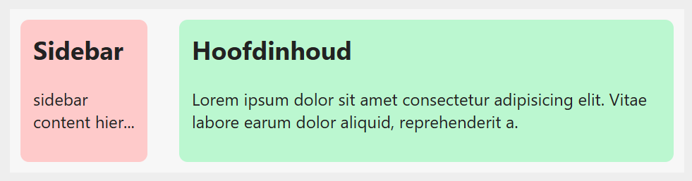

## Opdracht

Zet een smalle sidebar naast de hoofdinhoud, gecentreerd op de pagina.

1. Beperk de breedte van de wrapper tot maximaal 700px.
2. Centreer de wrapper horizontaal met `margin`.
3. Maak van de wrapper een flex-container.
4. Voorzie `30px` tussenruimte tussen sidebar en content.
5. Geef de sidebar een vaste breedte van 120px.

## Screenshot

