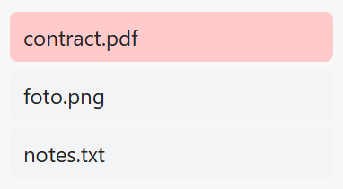

## Opdracht

Zet de bestanden onder elkaar; het vastgezette bestand staat bovenaan.

1. Maak de flex-container.
2. Zet de items in kolomrichting.
3. Zorg voor 6px tussenruimte.
4. Laat het element met class `.sticky` als eerste verschijnen via `order: -1`.

## Screenshot

