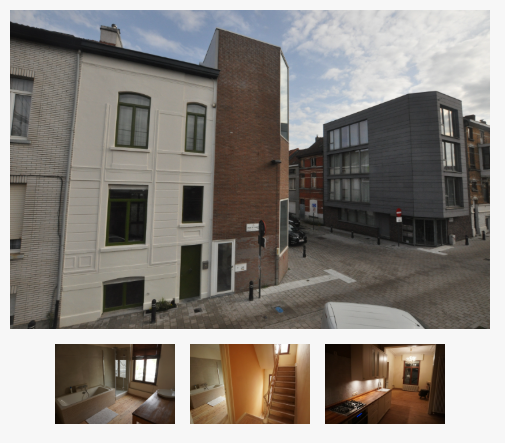

## Opdracht

Zet een rij thumbnails gecentreerd onder de grote foto.

1. Maak van de viewer een flex-container.
2. Zet het in kolomrichting.
3. Maak van de rij met thumbs onderaan een flex-container.
4. Zet 10px tussenruimte tussen de thumbnails.
5. Centreer de thumbnailrij.

## Screenshot

