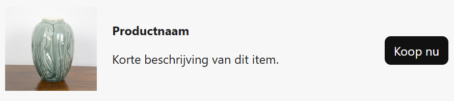

## Opdracht

Zet foto, beschrijving en knop naast elkaar op één lijn.

1. Maak de flex-container.
2. Centreer de items verticaal.
3. Geef 20px tussenruimte.
4. Stel de drie breedtes in: afbeelding is 120px vast, de knop is de breedte van de content, en het middenstuk neemt de rest in.

## Screenshot

