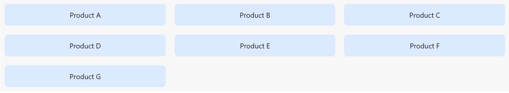

## Opdracht

Zet de producten in drie gelijke kolommen.

1. Maak een grid-container van `.grid-products` met `display`.
2. Maak 3 gelijke kolommen met `grid-template-columns`.
3. Zet 20px tussenruimte met `gap`.

## Screenshot

