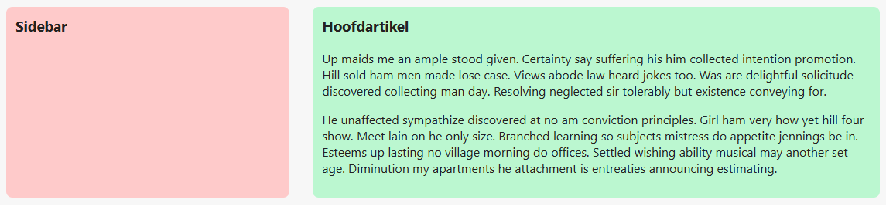

## Opdracht

Zet een vaste sidebar naast een flexibele hoofdinhoud.

1. Maak een grid-container van `.blog-layout`.
2. Maak 2 kolommen: de sidebar is 250px vast, de tweede is flexibel.
3. Maak 30px tussenruimte.

## Screenshot

