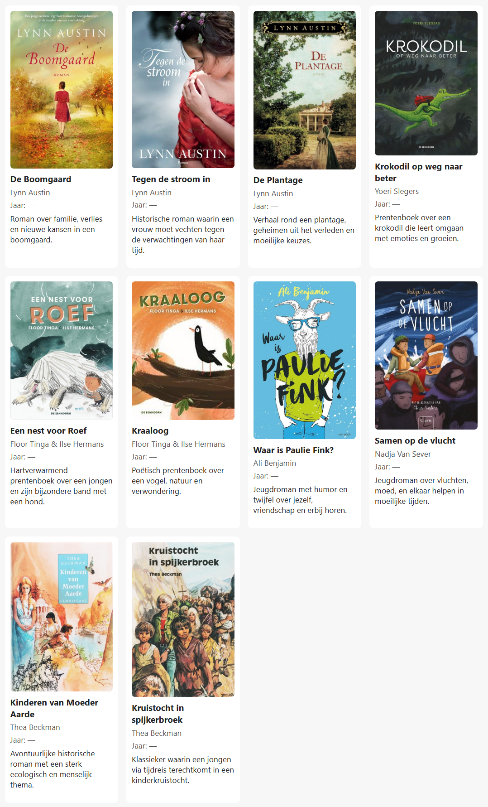

## Opdracht

Maak een gallerij van tien boeken.

1. Maak een grid-container van `.book-wall`.
2. Maak een tussenruimte van `15px`.
3. Maak vier gelijke kolommen.
4. Uitdaging: in plaats van vier kolommen, gebruik `repeat(auto-fill, minmax(...))` voor een mooie responsive grid (zie [dit voorbeeld](https://rogiervdl.github.io/CSS-course/04_layout.html#voorbeeld-5-foto-gallerij-grid)); maak het previewvenster smaller, en kijk wat gebeurt.

## Screenshot

