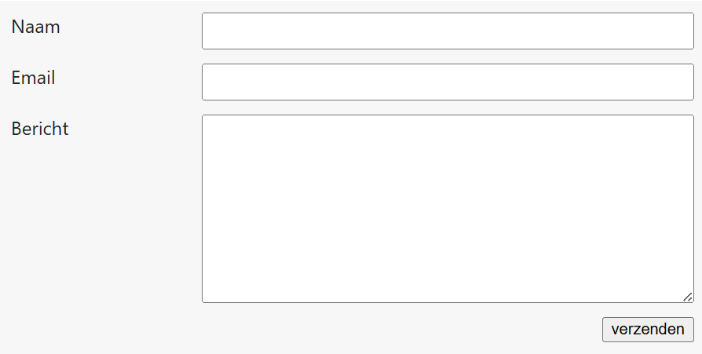

## Opdracht

Zet labels en invoervelden netjes in twee kolommen.

1. Maak van `.form-grid` een grid.
2. Maak 2 kolommen; de eerste is 150px breed.
3. Maak 3 rijen: de eerste twee zijn passend, laatste neemt de rest in.
4. Een tussenruimte overal van 12px.

## Screenshot

