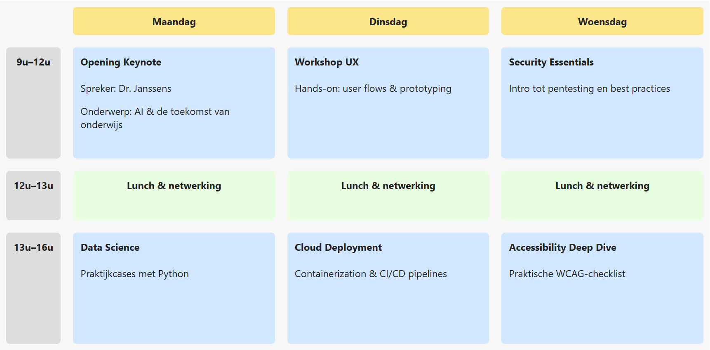

## Opdracht

Bouw een schema van drie dagen met vaste rijhoogtes.

1. Maak van `.conference` een grid-container; de tussenruimte is 20px.
2. Maak **4 kolommen**: de eerste passend, de laatste drie gelijk en flexibel.
3. Maak **4 rijen**: de eerste passend, de tweede en vierde 180px en de derde 80px hoog.

## Screenshot

