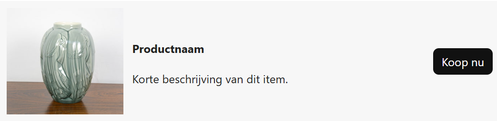

## Opdracht

Zet foto, beschrijving en knop naast elkaar, verticaal gecentreerd.

1. Maak een grid-container.
2. Maak drie kolommen, de eerste en laatste passend.
3. Centreer de items verticaal met `align-items`.

## Screenshot

