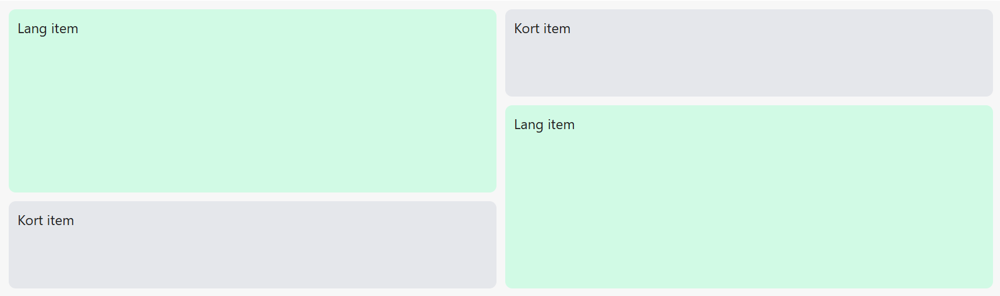

## Opdracht

Laat de lange items twee rijen overspannen.

1. Maak van `.pin-grid` een grid met 2 gelijke kolommen en 3 rijen van 100px hoog.
2. Maak een tussenruimte van 10px.
3. Items met class `tall` moeten dubbel zo hoog zijn.

## Screenshot

