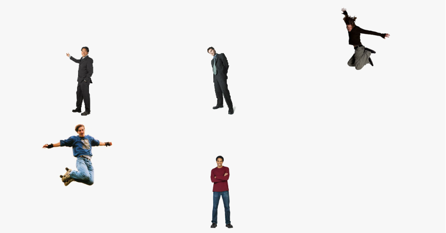

## Opdracht

Zet de figuren in een 3x2 grid; de springers hangen bovenaan.

1. Maak een 3x2 grid met drie gelijke kolommen, en twee rijen van 150px hoog.
2. Plaats alle figuren onderaan met `align-items`.
3. Plaats alle figuren horizontaal in het midden met `justify-items`.
4. Gebruik `align-self` om de springende figuren bovenaan te zetten.

## Screenshot

