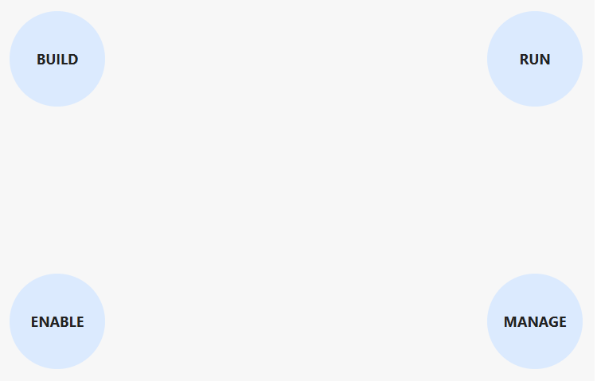

## Opdracht

Duw elke cel naar een andere buitenhoek van zijn vak.

1. Maak een 2x2 grid met twee gelijke kolommen, en twee rijen van 150px hoog.
2. Maak elke grid cell 80px hoog en breed; maak het rond met `border-radius`.
3. Aligneer de teksten verticaal (gebruik `line-height`) en horizontaal in het midden.
4. Gebruik `align-self` en `justify-self` om elke cel naar één van de vier buitenhoeken te duwen.

## Screenshot

