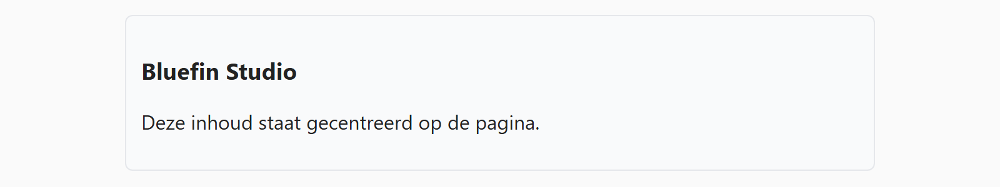

## Theorie

Een block-level element centreren kan met een trukje met `margin`: geef je het links en rechts de waarde `auto`, dan verdeelt de browser de beschikbare witruimte links en rechts, en staat het blok in het midden. Typisch wordt het gebruikt in combinatie met `max-width` om de breedte te beperken:

```css
.container {
   margin: 0 auto; /* boven/onder 0, links/rechts auto */
   max-width: 600px; 
}
```

Gebruik `max-width` en niet `width`: op een smal scherm krimpt het blok dan gewoon mee in plaats van uit beeld te lopen.

## Opdracht

Centreer een blok op de pagina.

1. Geef de container een maximumbreedte van `600px`.
2. Centreer de container

## Screenshot


