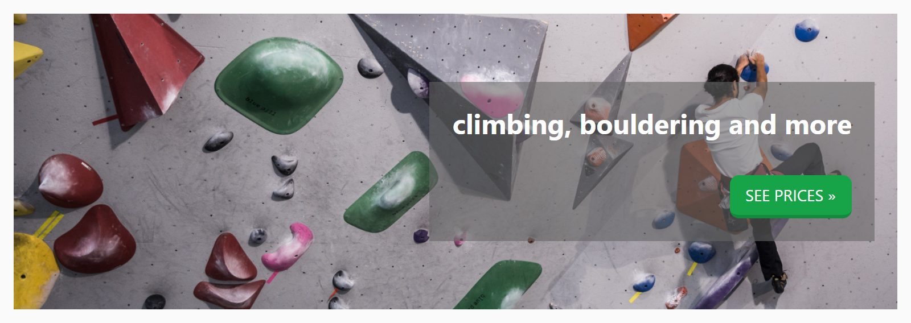

## Theorie

Hetzelfde trucje werkt ook asymmetrisch. Geef je enkel de **linkermarge** de waarde `auto`, dan wordt alle overschot aan die kant gelegd en schuift het blok naar rechts.

```css
.inset {
   margin-left: auto; /* alle vrije ruimte links */
   margin-right: 0;
}
```

Een andere handige CSS regel is `width: fit-content`. Daarmee stel je geen vaste of maximale breedte in, maar krimpt het blok tot de breedte van zijn eigen inhoudLet op: dit werkt enkel op block-level elementen. Een link of een span is inline, en die zet je eerst om met `display: block`.

## Opdracht

Beperk een blok in breedte en duw het naar rechts.

1. Maak de breedte van de inset passend met `width: fit-content`.
2. Zet de inset nu rechts door de linkermarge de waarde `auto` te geven, en de rechtermarge de waarde `0`.
3. Maak van de button eerst een blocklevel element met `display: block`.
4. Plaats nu op dezelfde manier de button rechts.

## Screenshot


