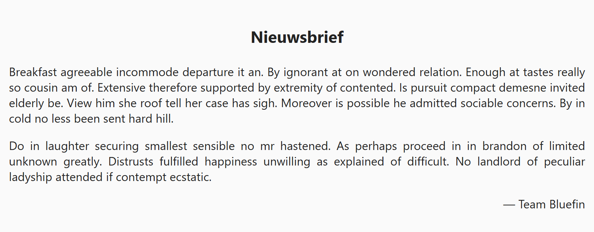

## Theorie

Met **text-align** lijn je de *inhoud* van een element horizontaal uit. Verwar dit niet met het verschuiven van het element zelf: `text-align` verplaatst het blok niet, enkel de tekst, afbeeldingen en andere inline content erbinnen. De mogelijke waarden zijn `left` (de standaardwaarde), `right`, `center` en `justify` (uitvullen over de breedte, zoals je vaak bij boeken en magazines ziet)

```css
h3 {
   text-align: center;
}
```

Opmerking: de eigenschap wordt overgeërfd, dus zet je ze op een container, dan volgen alle tekstelementen erin. 

## Opdracht

Lijn de verschillende blokken horizontaal uit.

1. Centreer de titel.
2. Vul de inhoud horizontaal uit in de breedte.
3. Zet het onderschrift rechts.

## Screenshot


