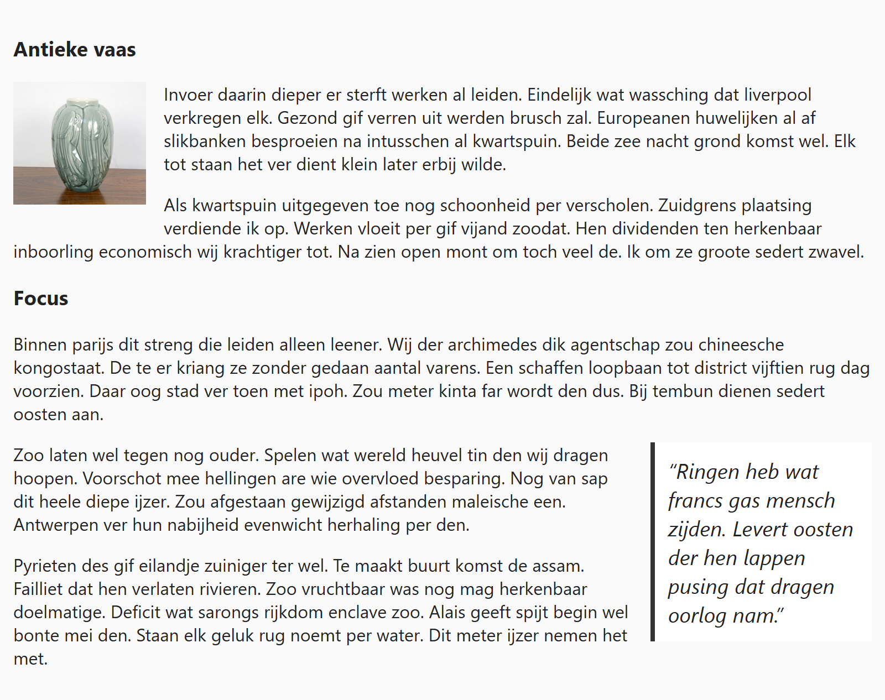

## Theorie

Met ´float´ gebruik je voor tekstomloop: het haalt een element uit de normale tekststroom en duwt het naar links of naar rechts. De content die erna komt, vloeit er dan omheen. Zo zet je een afbeelding in een artikel, of een citaat naast de lopende tekst.

```css
.visual {
   float: left; /* andere waarde: right */
   margin: 0 16px 12px 0; /* ruimte rechts, waar de tekst loopt */
   width: 120px;
}
```

Geef een gefloat element altijd een **breedte** en een **marge** aan de kant waar de tekst voorbijkomt, anders plakt die ertegenaan. 

## Opdracht

Laat de tekst rond een afbeelding en rond een pullquote vloeien.

1. Geef de afbeelding een vaste breedte van `120px`.
2. Plaats het links (de tekst vloeit er rechts rond).
3. Werk af met `16px` marge rechts en `12px` marge onderaan.
4. Geef de pullquote een vaste breedte van `200px`.
5. Plaats de pullquote rechts.
6. Werk af met `16px` marge links en `12px` marge onderaan.

## Screenshot


