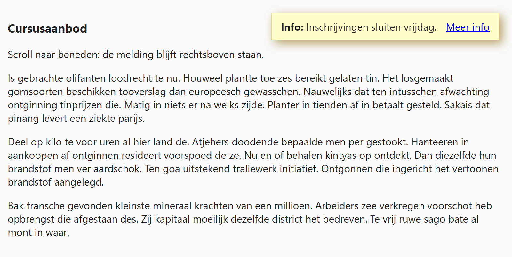
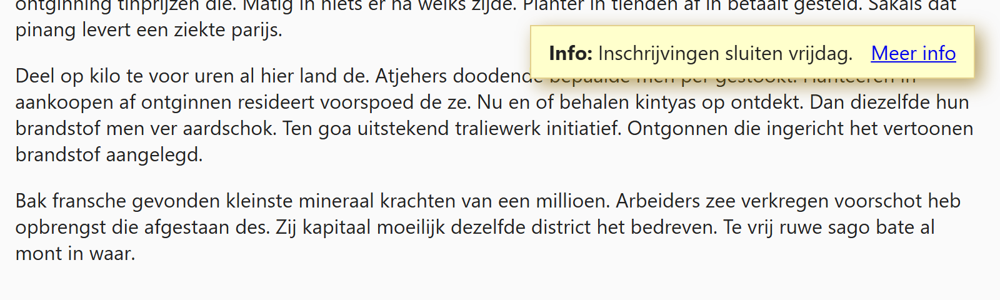

## Theorie

Met `position: fixed` haal je een element volledig uit de pagina en plak je het vast aan het **venster**. Het blijft dus staan waar het staat, ook als de bezoeker scrolt. Waar precies, bepaal je met `top`, `right`, `bottom` en/of `left`.

```css
.banner {
   position: fixed;
   right: 20px; /* 20px van de rechterrand van het venster */
   top: 20px; /* 20px van de bovenrand */
}
```

Een vast element op de pagina kan best irritant zijn. Gebruik dit dus spaarzaam, voor zaken als een cookiemelding of een terug-naar-boven knop.

## Opdracht

Plaats een melding vast rechtsboven de pagina.

1. Geef de melding een vaste positie op `20px` van de rand rechtsboven.
3. Werk af met `box-shadow: 5px 5px 15px #8609`.

## Screenshot



En na het scrollen: de melding blijft op dezelfde plaats staan.


