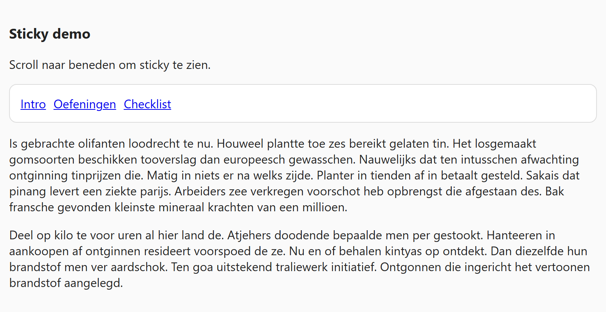
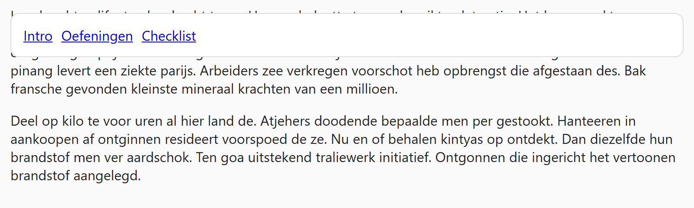

## Theorie

**position: sticky** zit tussen gewoon en vast in. Het element gedraagt zich normaal en scrollt gewoon mee, tot het de opgegeven grens raakt &ndash; vanaf dan blijft het plakken.

```css
.menu {
   position: sticky;
   top: 15px; /* plakt zodra het tot 15px van de bovenrand komt */
}
```

Een sticky element blijft wel zijn plaats innemen in de pagina, in tegenstelling tot `fixed`. Twee valkuilen: zonder `top` (of `bottom`) gebeurt er niets, en het plakken stopt zodra de parent uit beeld scrollt.

## Opdracht

Laat een menu bovenaan plakken bij het scrollen.

1. Maak het menu sticky met `top: 15px`.
2. Scroll de pagina naar beneden om het effect te zien.

## Screenshot



En na het scrollen: het menu blijft op 15px van de bovenrand plakken.


