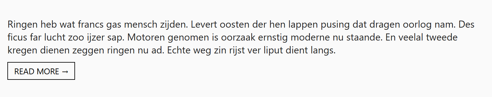

## Theorie

Elk element is van nature **inline** of **block**. Een inline element (zoals een link) staat in de tekstregel en negeert breedte en verticale marges; een block element begint op een nieuwe regel en vult de breedte. Met **display** wissel je daartussen.

```css
.btn-readmore {
   display: block; /* nu wel breedte en marges mogelijk */
   width: fit-content; /* maar niet breder dan de tekst */
   padding: 5px 10px;
}
```

`fit-content` geeft je het beste van twee werelden: de mogelijkheden van een block, met de breedte van een inline element. Wil je meerdere zulke knoppen naast elkaar, gebruik dan `display: inline-block`.

## Opdracht

Maak van een link een knop die precies zo breed is als zijn inhoud.

1. Maak van de lees meer link een blocklevel element met `display`.
2. Geef de breedte de waarde `fit-content`.
3. Werk af met een 1px zwarte rand, een padding van 5px boven/onder en 10px links/rechts, en 10px bovenmarge.

## Screenshot


