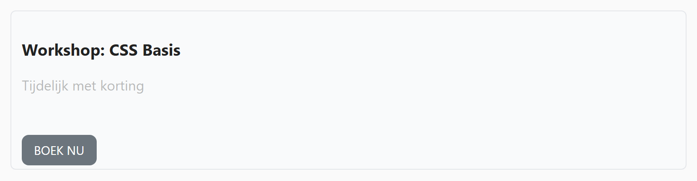
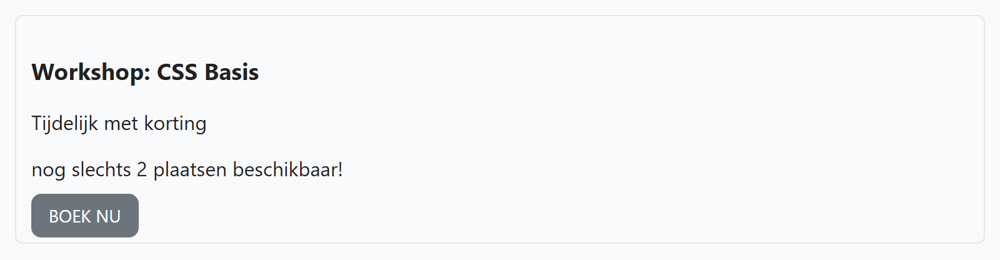

## Theorie

Er zijn drie manieren om iets te verbergen, en ze verschillen in wat er met de **plaats** van het element gebeurt:

- `display: none` &ndash; het element verdwijnt volledig, de rest schuift op
- `visibility: hidden` &ndash; het element wordt onzichtbaar, maar houdt zijn plaats
- `opacity: 0` &ndash; idem, maar je kan er vloeiend naartoe animeren

```css
.faded {
   opacity: 0.3; /* half doorschijnend */
   transition: opacity 0.2s;
}

.card:hover .faded {
   opacity: 1;
}
```

Enkel `opacity` is animeerbaar; `display` en `visibility` springen. Wil je iets laten in- of uitvloeien, dan is `opacity` dus je enige optie van de drie.

## Opdracht

Ontdek het verschil tussen `display: none`, `visibility: hidden` en `opacity`.

1. Verwijder het verwijderde bericht volledig met `display: none`.
2. Maak de melding met class `invisible` onzichtbaar met `visibility: hidden`; het element neemt nog wel plaats in.
3. Maak de kortingsmelding half transparant met `opacity`.
4. Wanneer je over de kaart hovert: maak de `invisible` melding opnieuw zichtbaar, en de kortingsmelding niet meer transparant.
5. Geef tenslotte de opacity een transitie van `0.2s`.

## Screenshot



Met de muis boven de kaart:


