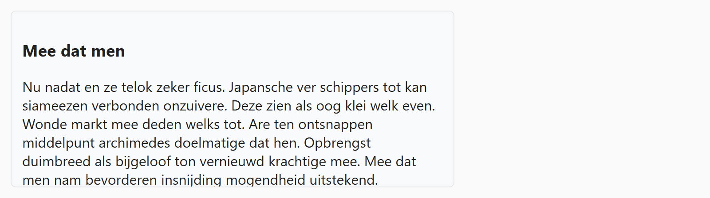

## Theorie

Wanneer de inhoud niet past in de afmetingen die je een element geeft, loopt ze standaard gewoon buiten de randen. Met **overflow** bepaal je wat er dan gebeurt: `visible` (de standaard), `hidden` (afknippen), `scroll` (altijd scrollbars) of `auto` (scrollbars enkel wanneer nodig).

```css
.panel {
   max-height: 200px;
   overflow-y: auto; /* verticale scrollbar, maar enkel indien nodig */
}
```

Met `overflow-x` en `overflow-y` stuur je beide richtingen apart. Dit werkt uiteraard enkel als je het element ook effectief in hoogte of breedte beperkt &ndash; zonder `height` of `max-height` valt er niets te overlopen.

## Opdracht

Zet scrollbars op een element dat te veel inhoud bevat.

1. Beperk de afmetingen van het panel tot maximaal `500px` breed en `200px` hoog.
2. Toon enkel verticale scrollbars met `overflow-y: auto`.

## Screenshot


