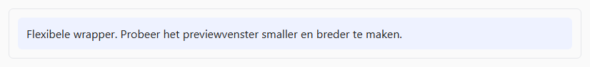

## Opdracht

De box hieronder heeft nu een vaste breedte van **960px**. Als het previewvenster te smal is, verschijnt een horizontale scrollbar. We passen dit aan.

1. Zorg dat de box nooit breder wordt dan de container met `max-width: 100%`.

## Tip

*Versleep de scheiding tussen editor en preview om het previewvenster smaller en breder te maken.*

## Screenshot

