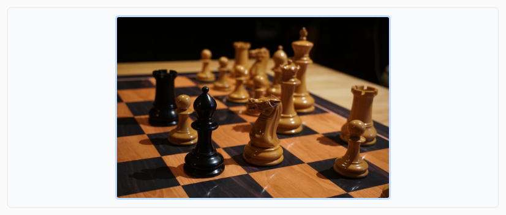

## Opdracht

Net zoals bij de vorige oefening stellen we een vaste breedte in, maar beperken we die tot 100% van de breedte van de container zodat het ook kleiner kan worden.

1. Geef de afbeelding een vaste breedte van **450px**.
2. Zorg dat de afbeelding nooit breder wordt dan de container.

## Screenshot

