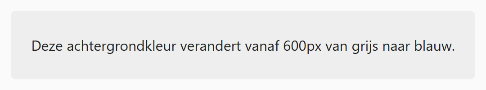
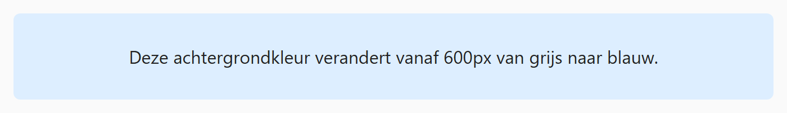

## Opdracht

De box hieronder heeft standaard een **lichtgrijze** achtergrond; we willen een lichtblauwe kleur op bredere schermen. Er is reeds een media query voorzien voor **600px**.

1. Voeg in de media query code toe om vanaf die schermbreedte de achtergrond **lichtblauw** (`#def`) te maken.

## Tip

*De media query kijkt naar de breedte van het previewvenster, niet van het browservenster. Versleep de scheiding tussen editor en preview om het breekpunt te testen.*

## Screenshots

Onder 600px:

Vanaf 600px:

