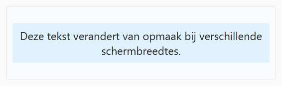
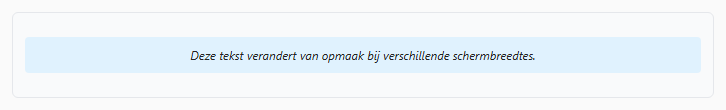
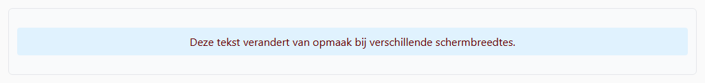

## Opdracht

We werken met twee media queries: 600px en 900px. Werk altijd *mobile-first*: sorteer breekpunten van klein naar groot, en gebruik enkel `@media (width >= ...)`.

1. Voeg media queries toe voor **600px** en **900px**.
2. Op kleine schermen is de lettergrootte **22px**.
3. Vanaf **600px** breedte moet de tekst **12px** en **schuin** worden.
4. Vanaf **900px** breedte moet de tekst **16px** worden, **niet schuin** en **donkerrood** (`#600`).

## Screenshots

Onder 600px:

Vanaf 600px:

Vanaf 900px:

