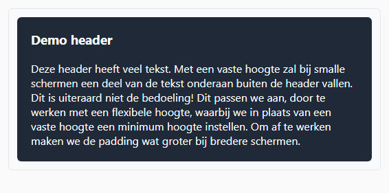
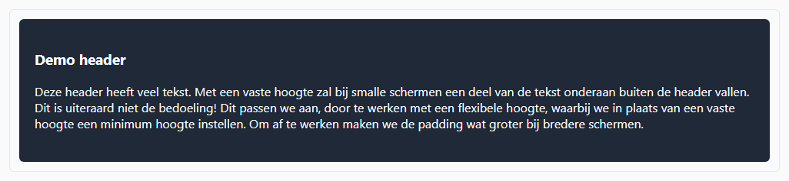

## Opdracht

De header hieronder heeft een vaste hoogte van **180px**. Maak het previewvenster smaller; een deel van de tekst zal verdwijnen. Dit kan beter.

1. Vervang de vaste hoogte van de header door een minimum hoogte.
2. Verander vanaf **900px** de padding boven en onder naar 40px.

## Screenshots

Onder 900px:

Vanaf 900px:

