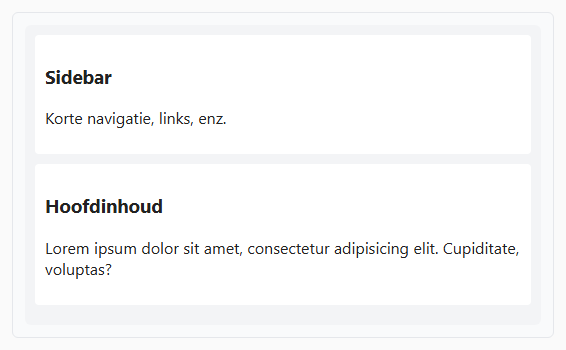
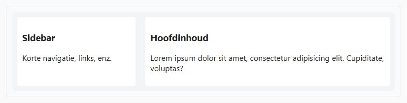

## Opdracht

Op dit moment staan sidebar en hoofdinhoud altijd naast elkaar. Dit willen we aanpassen, zodat ze standaard onder elkaar staan, en pas vanaf 700px naast elkaar.

1. Maak een media query voor **700px**.
2. Verplaats de flex-code die verantwoordelijk is voor de twee kolommen naar deze media query, zodat het pas vanaf 700px uitgevoerd wordt.
3. Verbeter het met een **10px margin** onder de sidebar bij kleine schermen, en vanaf 700px niet meer.

## Screenshots

Onder 700px:

Vanaf 700px:

