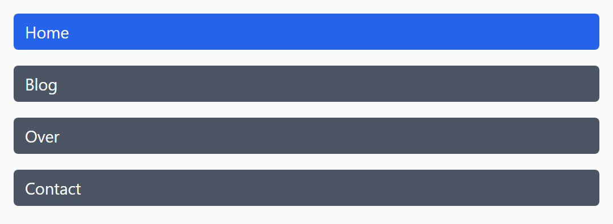
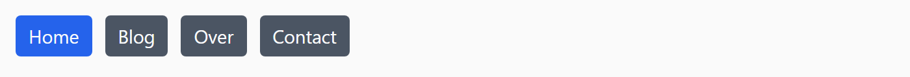

## Opdracht

Zet het menu verticaal op smalle schermen en horizontaal op brede.

1. Maak dit menu responsive: zet het verticaal en vanaf 600px horizontaal (gebruik `flex-direction`).

## Screenshots

Onder 600px:

Vanaf 600px:

