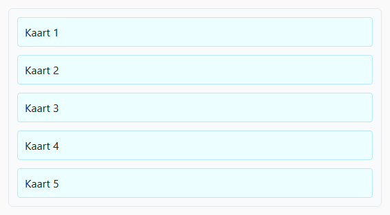
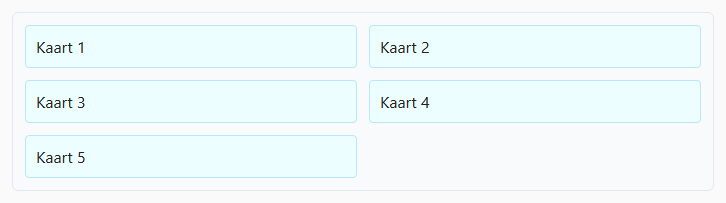
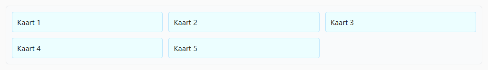

## Opdracht

Laat het grid meegroeien van één naar drie kolommen.

1. Op kleine schermen toont het grid **1 kolom**.
2. Vanaf **600px** moeten er **2 kolommen** zijn.
3. Vanaf **900px** moeten er **3 kolommen** zijn.

## Screenshots

Onder 600px:

Vanaf 600px:

Vanaf 900px:

