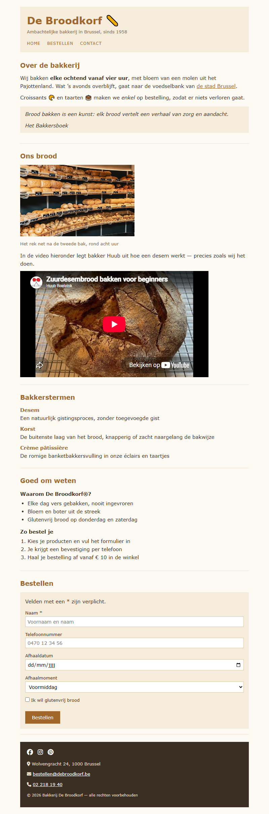

## Doel

Dit is een oefening op HTML: tekst, karakters en iconen, citaten, media, lijsten, formulieren en het structureren van een pagina — zie [https://rogiervdl.github.io/HTML-course/](https://rogiervdl.github.io/HTML-course/).

## Opgave

Bouw de pagina van bakkerij *De Broodkorf* volledig op in HTML op basis van de screenshot. Alle teksten krijg je hieronder kant en klaar: jij kiest voor elk stuk het **juiste element** en zet de pagina correct in elkaar. De opmaak staat in `styles.css` — dat bestand pas je **niet** aan.

Nog wat je verder nodig hebt:

- De foto heet "bakkerij.jpg" en staat in een submap "img".
- De iconen komen van **FontAwesome**, dat al gekoppeld is in de stylesheet. Je zoekt ze zelf op via [https://fontawesome.com/search](https://fontawesome.com/search).
- Het veld *Naam* is verplicht; de lichtgrijze teksten in de invulvelden zijn placeholders (ze staan hieronder tussen haakjes).
- "de stad Brussel" in de eerste paragraaf is een link naar https://www.brussel.be/.
- De video bij *Ons brood* is [Zuurdesembrood bakken voor beginners](https://www.youtube.com/watch?v=Myn_JeuUlU0). Bestaat die niet meer, dan zoek je op YouTube gewoon een andere video over brood bakken. Ze hoeft niet dezelfde te zijn als op de screenshot.

## Screenshot

## Inhoud

Alle teksten van de pagina staan hieronder, zonder opmaak, zodat je ze kan kopiëren.

De Broodkorf 🥖

Ambachtelijke bakkerij in Brussel, sinds 1958

Home

Bestellen

Contact

Over de bakkerij

Wij bakken elke ochtend vanaf vier uur, met bloem van een molen uit het Pajottenland. Wat 's avonds overblijft, gaat naar de voedselbank van de stad Brussel.

Croissants 🥐 en taarten 🎂 maken we enkel op bestelling, zodat er niets verloren gaat.

Brood bakken is een kunst: elk brood vertelt een verhaal van zorg en aandacht.

Het Bakkersboek

Ons brood

Het rek net na de tweede bak, rond acht uur

In de video hieronder legt bakker Huub uit hoe een desem werkt — precies zoals wij het doen.

Bakkerstermen

Desem

Een natuurlijk gistingsproces, zonder toegevoegde gist

Korst

De buitenste laag van het brood, knapperig of zacht naargelang de bakwijze

Crème pâtissière

De romige banketbakkersvulling in onze éclairs en taartjes

Goed om weten

Waarom De Broodkorf®?

Elke dag vers gebakken, nooit ingevroren

Bloem en boter uit de streek

Glutenvrij brood op donderdag en zaterdag

Zo bestel je

Kies je producten en vul het formulier in

Je krijgt een bevestiging per telefoon

Haal je bestelling af vanaf € 10 in de winkel

Bestellen

Velden met een * zijn verplicht.

Naam * (placeholder: Voornaam en naam)

Telefoonnummer (placeholder: 0470 12 34 56)

Afhaaldatum

Afhaalmoment

Voormiddag

Middag

Namiddag

Ik wil glutenvrij brood

Bestellen

Wolvengracht 24, 1000 Brussel

bestellen@debroodkorf.be

02 218 19 40

© 2026 Bakkerij De Broodkorf — alle rechten voorbehouden
