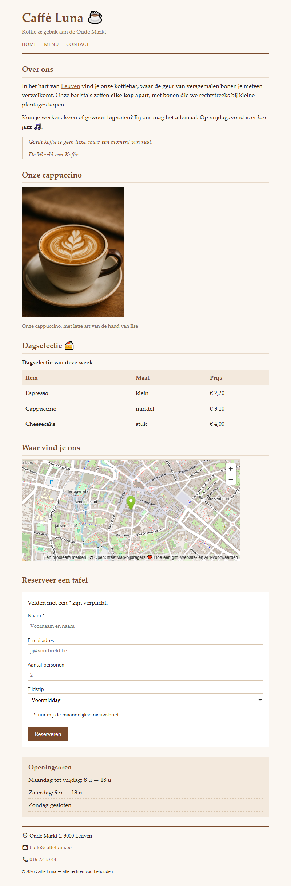

## Doel

Dit is een oefening op HTML: tekst, karakters en iconen, citaten, media, tabellen, formulieren en het structureren van een pagina — zie [https://rogiervdl.github.io/HTML-course/](https://rogiervdl.github.io/HTML-course/).

## Opgave

Bouw de pagina van koffiebar *Caffè Luna* volledig op in HTML op basis van de screenshot. Alle teksten krijg je hieronder kant en klaar: jij kiest voor elk stuk het **juiste element** en zet de pagina correct in elkaar. De opmaak staat in `styles.css` — dat bestand pas je **niet** aan.

Nog wat je verder nodig hebt:

- De foto heet "cappuccino.jpg" en staat in een submap "img".
- De iconen komen van **Google Icons**, dat al gekoppeld is in de stylesheet. Je zoekt ze zelf op via [https://fonts.google.com/icons](https://fonts.google.com/icons).
- Het veld *Naam* is verplicht; de lichtgrijze teksten in de invulvelden zijn placeholders (ze staan hieronder tussen haakjes).
- "Leuven" in de eerste paragraaf is een link naar https://www.leuven.be/.
- De kaart bij *Waar vind je ons* toont Oude Markt 1 in Leuven. Zoek dat adres op **OpenStreetMap** en haal daar de insluitcode van de kaart.

## Screenshot

## Inhoud

Alle teksten van de pagina staan hieronder, zonder opmaak, zodat je ze kan kopiëren.

Caffè Luna ☕

Koffie & gebak aan de Oude Markt

Home

Menu

Contact

Over ons

In het hart van Leuven vind je onze koffiebar, waar de geur van versgemalen bonen je meteen verwelkomt. Onze barista's zetten elke kop apart, met bonen die we rechtstreeks bij kleine plantages kopen.

Kom je werken, lezen of gewoon bijpraten? Bij ons mag het allemaal. Op vrijdagavond is er live jazz 🎵.

Goede koffie is geen luxe, maar een moment van rust.

De Wereld van Koffie

Onze cappuccino

Onze cappuccino, met latte art van de hand van Ilse

Dagselectie 🍰

Dagselectie van deze week

Item   Maat   Prijs

Espresso   klein   € 2,20

Cappuccino   middel   € 3,10

Cheesecake   stuk   € 4,00

Waar vind je ons

Reserveer een tafel

Velden met een * zijn verplicht.

Naam * (placeholder: Voornaam en naam)

E-mailadres (placeholder: jij@voorbeeld.be)

Aantal personen (placeholder: 2)

Tijdstip

Voormiddag

Namiddag

Avond

Stuur mij de maandelijkse nieuwsbrief

Reserveren

Openingsuren

Maandag tot vrijdag: 8 u — 18 u

Zaterdag: 9 u — 18 u

Zondag gesloten

Oude Markt 1, 3000 Leuven

hallo@caffeluna.be

016 22 33 44

© 2026 Caffè Luna — alle rechten voorbehouden
