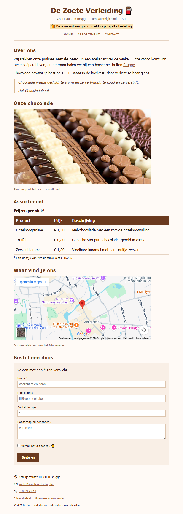

## Doel

Dit is een oefening op HTML: tekst, karakters en iconen, citaten, media, tabellen, formulieren en het structureren van een pagina — zie [https://rogiervdl.github.io/HTML-course/](https://rogiervdl.github.io/HTML-course/).

## Opgave

Bouw de pagina van chocolatier *De Zoete Verleiding* volledig op in HTML op basis van de screenshot. Alle teksten krijg je hieronder kant en klaar: jij kiest voor elk stuk het **juiste element** en zet de pagina correct in elkaar. De opmaak staat in `styles.css` — dat bestand pas je **niet** aan.

Nog wat je verder nodig hebt:

- De foto heet "chocolade.jpg" en staat in een submap "img".
- De iconen komen van **Google Icons**, dat al gekoppeld is in de stylesheet. Je zoekt ze zelf op via [https://fonts.google.com/icons](https://fonts.google.com/icons).
- Het veld *Naam* is verplicht; de lichtgrijze teksten in de invulvelden zijn placeholders (ze staan hieronder tussen haakjes).
- "Brugge" in de eerste paragraaf is een link naar https://www.brugge.be/.
- De kaart bij *Waar vind je ons* toont Katelijnestraat 10 in Brugge. Zoek dat adres op **Google Maps** en haal daar de insluitcode van de kaart.

## Screenshot



## Inhoud

Teksten van de pagina, zodat je ze kan kopiëren:

```
De Zoete Verleiding

Chocolatier in Brugge — ambachtelijk sinds 1971

Deze maand een gratis proefdoosje bij elke bestelling

Home

Assortiment

Contact

Over ons

Wij trekken onze pralines met de hand, in een atelier achter de winkel. Onze cacao komt van twee coöperatieven, en de room halen we bij een hoeve net buiten Brugge.

Chocolade bewaar je best bij 16 °C, nooit in de koelkast: daar verliest ze haar glans.

Chocolade vraagt geduld: te warm en ze verbrandt, te koud en ze verstijft.

Het Chocoladeboek

Onze chocolade

Een greep uit het vaste assortiment

Assortiment

Prijzen per stuk1

Product   Prijs   Beschrijving

Hazelnootpraline   € 1,50   Melkchocolade met een romige hazelnootvulling

Truffel   € 0,80   Ganache van pure chocolade, gerold in cacao

Zeezoutkaramel   € 1,80   Vloeibare karamel met een snuifje zeezout

1 Een doosje van twaalf stuks kost € 16,50.

Waar vind je ons

Op wandelafstand van het Minnewater.

Bestel een doos

Velden met een * zijn verplicht.

Naam * (placeholder: Voornaam en naam)

E-mailadres (placeholder: jij@voorbeeld.be)

Aantal doosjes (placeholder: 1)

Boodschap bij het cadeau (placeholder: Van harte!)

Verpak het als cadeau

Bestellen

Katelijnestraat 10, 8000 Brugge

winkel@zoeteverleiding.be

050 33 47 12

Privacybeleid

Algemene voorwaarden

© 2026 De Zoete Verleiding® — alle rechten voorbehouden
```