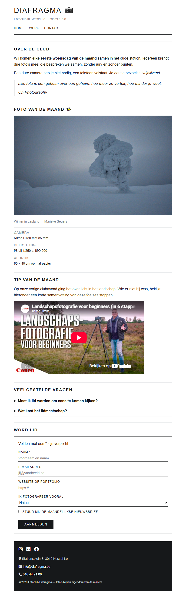

## Doel

Dit is een oefening op HTML: tekst, karakters en iconen, citaten, media, lijsten, formulieren en het structureren van een pagina — zie [https://rogiervdl.github.io/HTML-course/](https://rogiervdl.github.io/HTML-course/).

## Opgave

Bouw de pagina van fotoclub *Diafragma* volledig op in HTML op basis van de screenshot. Alle teksten krijg je hieronder kant en klaar: jij kiest voor elk stuk het **juiste element** en zet de pagina correct in elkaar. De opmaak staat in `styles.css` — dat bestand pas je **niet** aan.

Nog wat je verder nodig hebt:

- De foto heet "winter.jpg" en staat in een submap "img".
- De iconen komen van **FontAwesome**, dat al gekoppeld is in de stylesheet. Je zoekt ze zelf op via [https://fontawesome.com/search](https://fontawesome.com/search).
- Het veld *Naam* is verplicht; de lichtgrijze teksten in de invulvelden zijn placeholders (ze staan hieronder tussen haakjes).
- "het FOMU in Antwerpen" bij de tweede vraag is een link naar https://www.fotomuseum.be/.
- De video bij *Tip van de maand* is [Landschapsfotografie voor beginners (in 6 stappen)](https://www.youtube.com/watch?v=CRdDGgBP3_w). Bestaat die niet meer, dan zoek je op YouTube gewoon een andere video over landschapsfotografie. Ze hoeft niet dezelfde te zijn als op de screenshot.

## Screenshot



## Inhoud

Teksten van de pagina, zodat je ze kan kopiëren:

```
Diafragma

Fotoclub in Kessel-Lo — sinds 1998

Home

Werk

Contact

Over de club

Wij komen elke eerste woensdag van de maand samen in het oude station. Iedereen brengt drie foto's mee; die bespreken we samen, zonder jury en zonder punten.

Een dure camera heb je niet nodig, een telefoon volstaat. Je eerste bezoek is vrijblijvend.

Een foto is een geheim over een geheim: hoe meer ze vertelt, hoe minder je weet.

On Photography

Foto van de maand

Winter in Lapland — Marieke Segers

Camera

Nikon D750 met 35 mm

Belichting

f/8 bij 1/250 s, ISO 200

Afdruk

60 × 40 cm op mat papier

Tip van de maand

Op onze vorige clubavond ging het over licht in het landschap. Wie er niet bij was, bekijkt hieronder een korte samenvatting van dezelfde zes stappen.

Veelgestelde vragen

Moet ik lid worden om eens te komen kijken?

Nee. Kom gerust een keer meekijken; pas daarna beslis je of je lid wordt.

Wat kost het lidmaatschap?

Vijfendertig euro per jaar, inclusief de drie tentoonstellingen die we jaarlijks inrichten en een groepsbezoek aan het FOMU in Antwerpen.

Word lid

Velden met een * zijn verplicht.

Naam * (placeholder: Voornaam en naam)

E-mailadres (placeholder: jij@voorbeeld.be)

Website of portfolio (placeholder: https://)

Ik fotografeer vooral

Natuur

Portret

Straat

Stuur mij de maandelijkse nieuwsbrief

Aanmelden

Stationsplein 3, 3010 Kessel-Lo

info@diafragma.be

016 44 21 09

© 2026 Fotoclub Diafragma — foto's blijven eigendom van de makers
```