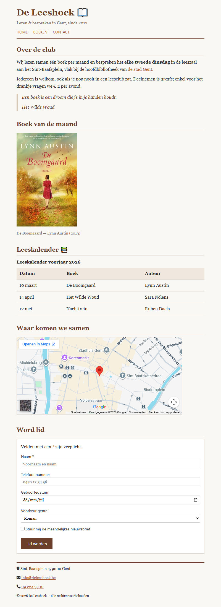

## Doel

Dit is een oefening op HTML: tekst, karakters en iconen, citaten, media, tabellen, formulieren en het structureren van een pagina — zie [https://rogiervdl.github.io/HTML-course/](https://rogiervdl.github.io/HTML-course/).

## Opgave

Bouw de pagina van boekenclub *De Leeshoek* volledig op in HTML op basis van de screenshot. Alle teksten krijg je hieronder kant en klaar: jij kiest voor elk stuk het **juiste element** en zet de pagina correct in elkaar. De opmaak staat in `styles.css` — dat bestand pas je **niet** aan.

Nog wat je verder nodig hebt:

- De afbeelding van het boek heet "boek.png" en staat in een submap "img".
- De iconen komen van **FontAwesome**, dat al gekoppeld is in de stylesheet. Je zoekt ze zelf op via [https://fontawesome.com/search](https://fontawesome.com/search).
- Het veld *Naam* is verplicht; de lichtgrijze teksten in de invulvelden zijn placeholders (ze staan hieronder tussen haakjes).
- "de stad Gent" in de eerste paragraaf is een link naar https://www.gent.be/.
- De kaart bij *Waar komen we samen* toont Sint-Baafsplein 4 in Gent. Zoek dat adres op **Google Maps** en haal daar de insluitcode van de kaart.

## Screenshot



## Inhoud

Teksten van de pagina, zodat je ze kan kopiëren:

```
De Leeshoek

Lezen & bespreken in Gent, sinds 2012

Home

Boeken

Contact

Over de club

Wij lezen samen één boek per maand en bespreken het elke tweede dinsdag in de leeszaal aan het Sint-Baafsplein, vlak bij de hoofdbibliotheek van de stad Gent.

Iedereen is welkom, ook als je nog nooit in een leesclub zat. Deelnemen is gratis; enkel voor het drankje vragen we € 2 per avond.

Een boek is een droom die je in je handen houdt.

Het Wilde Woud

Boek van de maand

De Boomgaard — Lynn Austin (2019)

Leeskalender

Leeskalender voorjaar 2026

Datum   Boek   Auteur

10 maart   De Boomgaard   Lynn Austin

14 april   Het Wilde Woud   Sara Nolens

12 mei   Nachttrein   Ruben Daels

Waar komen we samen

Word lid

Velden met een * zijn verplicht.

Naam * (placeholder: Voornaam en naam)

Telefoonnummer (placeholder: 0470 12 34 56)

Geboortedatum

Voorkeur genre

Roman

Thriller

Non-fictie

Stuur mij de maandelijkse nieuwsbrief

Lid worden

Sint-Baafsplein 4, 9000 Gent

info@deleeshoek.be

09 224 33 10

© 2026 De Leeshoek — alle rechten voorbehouden
