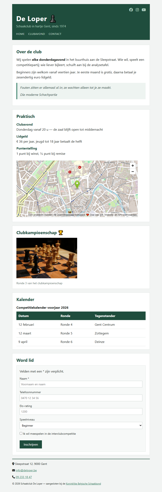

## Doel

Dit is een oefening op HTML: tekst, karakters en iconen, citaten, media, tabellen, formulieren en het structureren van een pagina — zie [https://rogiervdl.github.io/HTML-course/](https://rogiervdl.github.io/HTML-course/).

## Opgave

Bouw de pagina van schaakclub *De Loper* volledig op in HTML op basis van de screenshot. Alle teksten krijg je hieronder kant en klaar: jij kiest voor elk stuk het **juiste element** en zet de pagina correct in elkaar. De opmaak staat in `styles.css` — dat bestand pas je **niet** aan.

Nog wat je verder nodig hebt:

- De foto van het schaakbord heet "schaken.jpg" en staat in een submap "img".
- De iconen komen van **FontAwesome**, dat al gekoppeld is in de stylesheet. Je zoekt ze zelf op via [https://fontawesome.com/search](https://fontawesome.com/search).
- Het veld *Naam* is verplicht; de lichtgrijze teksten in de invulvelden zijn placeholders (ze staan hieronder tussen haakjes).
- De naam van de schaakbond onderaan is een link naar https://www.frbe-kbsb.be/.
- De kaart bij *Praktisch* toont Sleepstraat 12 in Gent. Zoek dat adres op **OpenStreetMap** en haal daar de insluitcode van de kaart.

## Screenshot



## Inhoud

Teksten van de pagina, zodat je ze kan kopiëren:

```
De Loper 

Schaakclub in hartje Gent, sinds 1974

Home

Clubavond

Contact

Over de club

Wij spelen elke donderdagavond in het buurthuis aan de Sleepstraat. Wie wil, speelt een competitiepartij; wie liever bijleert, schuift aan bij de analysetafel.

Beginners zijn welkom vanaf veertien jaar. Je eerste maand is gratis, daarna betaal je zesendertig euro lidgeld.

Fouten zitten er allemaal al in; ze wachten alleen tot je ze maakt.

Die moderne Schachpartie

Praktisch

Clubavond

Donderdag vanaf 20 u — de zaal blijft open tot middernacht

Lidgeld

€ 36 per jaar, jeugd tot 18 jaar betaalt de helft

Puntentelling

1 punt bij winst, ½ punt bij remise

Clubkampioenschap

Ronde 3 van het clubkampioenschap

Kalender

Competitiekalender voorjaar 2026

Datum   Ronde   Tegenstander

12 februari   Ronde 4   Gent Centrum

12 maart   Ronde 5   Zottegem

9 april   Ronde 6   Deinze

Word lid

Velden met een * zijn verplicht.

Naam * (placeholder: Voornaam en naam)

Telefoonnummer (placeholder: 0470 12 34 56)

Elo-rating (placeholder: 1200)

Speelniveau

Beginner

Clubspeler

Competitiespeler

Ik wil meespelen in de interclubcompetitie

Inschrijven

Sleepstraat 12, 9000 Gent

info@deloper.be

09 233 18 47

© 2026 Schaakclub De Loper — aangesloten bij de Koninklijke Belgische Schaakbond
```