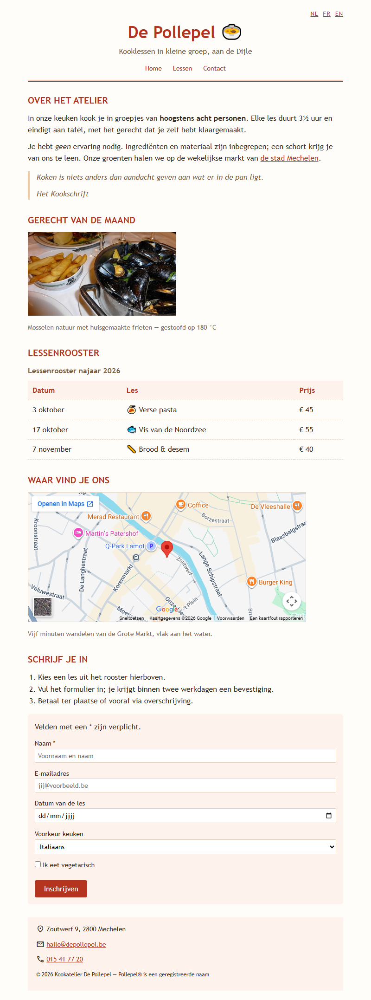

## Doel

Dit is een oefening op HTML: tekst, karakters en iconen, citaten, media, tabellen, formulieren en het structureren van een pagina — zie [https://rogiervdl.github.io/HTML-course/](https://rogiervdl.github.io/HTML-course/).

## Opgave

Bouw de pagina van kookatelier *De Pollepel* volledig op in HTML op basis van de screenshot. Alle teksten krijg je hieronder kant en klaar: jij kiest voor elk stuk het **juiste element** en zet de pagina correct in elkaar. De opmaak staat in `styles.css` — dat bestand pas je **niet** aan.

Nog wat je verder nodig hebt:

- De foto van het gerecht heet "mosselen.jpg" en staat in een submap "img".
- De iconen komen van **Google Icons**, dat al gekoppeld is in de stylesheet. Je zoekt ze zelf op via [https://fonts.google.com/icons](https://fonts.google.com/icons).
- Het veld *Naam* is verplicht; de lichtgrijze teksten in de invulvelden zijn placeholders (ze staan hieronder tussen haakjes).
- "de stad Mechelen" in de tweede paragraaf is een link naar https://www.mechelen.be/.
- De kaart bij *Waar vind je ons* toont Zoutwerf 9 in Mechelen. Zoek dat adres op **Google Maps** en haal daar de insluitcode van de kaart.

## Screenshot

## Inhoud

Alle teksten van de pagina staan hieronder, zonder opmaak, zodat je ze kan kopiëren. NL, FR en EN bovenaan zijn de taalkeuze; het zijn links (`href="#"`).

NL

FR

EN

De Pollepel 🍲

Kooklessen in kleine groep, aan de Dijle

Home

Lessen

Contact

Over het atelier

In onze keuken kook je in groepjes van hoogstens acht personen. Elke les duurt 3½ uur en eindigt aan tafel, met het gerecht dat je zelf hebt klaargemaakt.

Je hebt geen ervaring nodig. Ingrediënten en materiaal zijn inbegrepen; een schort krijg je van ons te leen. Onze groenten halen we op de wekelijkse markt van de stad Mechelen.

Koken is niets anders dan aandacht geven aan wat er in de pan ligt.

Het Kookschrift

Gerecht van de maand

Mosselen natuur met huisgemaakte frieten — gestoofd op 180 °C

Lessenrooster

Lessenrooster najaar 2026

Datum   Les   Prijs

3 oktober   🍝 Verse pasta   € 45

17 oktober   🐟 Vis van de Noordzee   € 55

7 november   🥖 Brood & desem   € 40

Waar vind je ons

Vijf minuten wandelen van de Grote Markt, vlak aan het water.

Schrijf je in

Kies een les uit het rooster hierboven.

Vul het formulier in; je krijgt binnen twee werkdagen een bevestiging.

Betaal ter plaatse of vooraf via overschrijving.

Velden met een * zijn verplicht.

Naam * (placeholder: Voornaam en naam)

E-mailadres (placeholder: jij@voorbeeld.be)

Datum van de les

Voorkeur keuken

Italiaans

Vis

Bakken

Ik eet vegetarisch

Inschrijven

Zoutwerf 9, 2800 Mechelen

hallo@depollepel.be

015 41 77 20

© 2026 Kookatelier De Pollepel — Pollepel® is een geregistreerde naam
