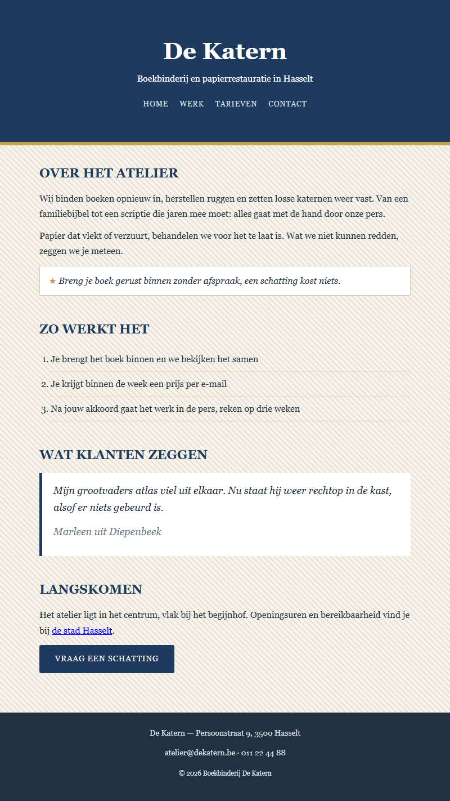

## Doel

Dit is een oefening op CSS design: kleuren, lettertypes, achtergronden, randen, effecten en het box model — zie [https://rogiervdl.github.io/CSS-course/02_design.html](https://rogiervdl.github.io/CSS-course/02_design.html) en [https://rogiervdl.github.io/CSS-course/03_boxmodel.html](https://rogiervdl.github.io/CSS-course/03_boxmodel.html).

## Opgave

De HTML van boekbinderij **De Katern** is gegeven en pas je **niet** aan. Jij zorgt enkel voor de opmaak. In `styles.css` staan de TODO's op de juiste plaats — vul ze aan.

## Selectoren

In deze oefening gebruik je minstens deze soorten selectoren:

- een **id**-selector (bv voor de kop)
- **tag**-selectoren (bv voor de body, de titels, de paragrafen en het citaat)
- **class**-selectoren (bv voor de tip en de knop)
- **combinaties** (bv voor de menulinks en de bronvermelding in het citaat)
- **`:hover`** (bv op de menulinks en op de knop)
- een **pseudo-element** (voor het teken vóór de tip) en een **contextuele selector** (voor de stappen)

## Taken

1. **body** — achtergrondkleur `#f7f4ec` met daarover het **herhalende** patroon `img/patroon.png` (de tegel wordt in beide richtingen herhaald), tekstkleur `#23303f`, als lettertype `Georgia` met `Times New Roman` en `serif` als reservewaarden, lettergrootte `16px` en regelhoogte `1.7`.
2. **Koppen en paragrafen** —
   - hoofdtitel in de kop: `42px`
   - sectietitels: `23px`, kleur `#1f3a5f`, in hoofdletters, `12px` ruimte eronder
   - paragrafen: `12px` ruimte onder elke paragraaf
3. **kop** — achtergrondkleur `#1f3a5f`, witte tekst, gecentreerd, met `55px` ruimte boven en onder en `20px` links en rechts, en onderaan een rand van `6px` massief `#c8a24a`. Geef de kop **geen** vaste hoogte.
4. **Menulinks** — de regel die het menu naast elkaar zet is gegeven; jij doet de opmaak van de links zelf. Ze zijn `#d7e2ef`, `13px`, in hoofdletters, met `1px` letterafstand en zonder onderlijning. Bij hover worden ze `#c8a24a`; laat die kleur vloeiend overgaan in `0.3s`.
5. **Tip en stappen** —
   - de tip: witte achtergrond, rand van `1px` massief `#d5cdb9`, schuine tekst, `12px` ruimte boven en onder en `16px` links en rechts
   - zet vóór de tekst van de tip het teken `★` gevolgd door een spatie, in `#c8a24a` en niet schuin. Doe dat zonder de HTML aan te passen.
   - de stappen die **rechtstreeks** in de stappenlijst staan: onderrand van `1px` stippellijn `#d5cdb9`, `8px` ruimte boven en onder, en `20px` marge links zodat de nummers zichtbaar blijven
6. **blockquote** — witte achtergrond, linkerrand van `5px` massief `#1f3a5f`, schuine tekst van `18px`, `16px` ruimte boven en onder en `20px` links en rechts. De bronvermelding erin wordt `#6b7787`.
7. **Knop** — achtergrondkleur `#1f3a5f`, witte tekst, geen onderlijning, in hoofdletters, `14px` met `1px` letterafstand, afgeronde hoeken van `3px`, en `13px` ruimte boven en onder, `28px` links en rechts. Zorg dat die ruimte ook echt zichtbaar is (denk aan het verschil tussen inline en block). Bij hover wordt de achtergrond `#c8a24a`, vloeiend in `0.3s`.
8. **footer** — achtergrondkleur `#23303f`, tekstkleur `#d7e2ef`, `14px`, `25px` ruimte boven en onder en `20px` links en rechts, gecentreerde tekst.

## Screenshot

