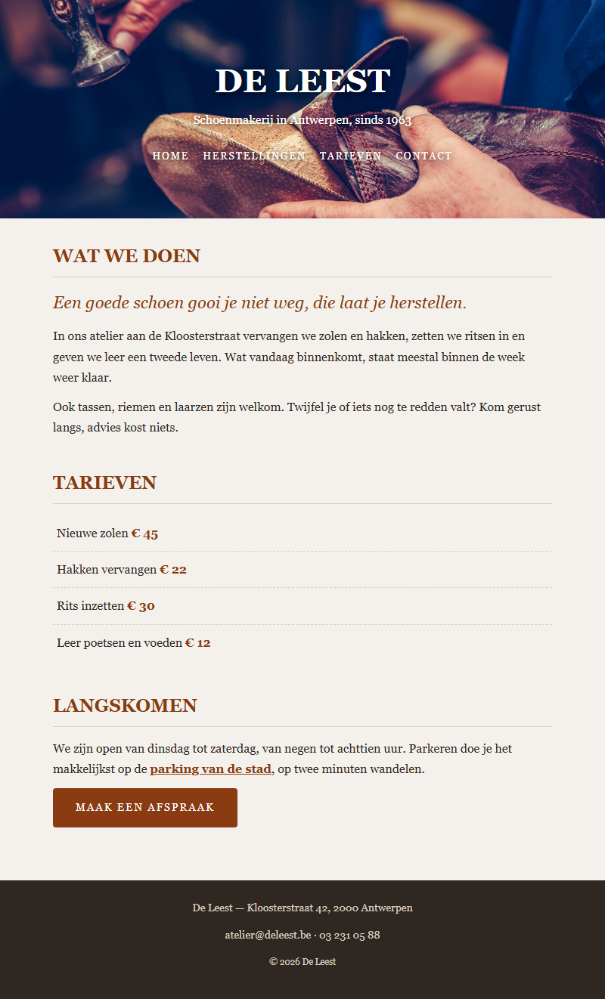

## Doel

Dit is een oefening op CSS design: kleuren, lettertypes, achtergronden, randen, effecten en het box model — zie [https://rogiervdl.github.io/CSS-course/02_design.html](https://rogiervdl.github.io/CSS-course/02_design.html) en [https://rogiervdl.github.io/CSS-course/03_boxmodel.html](https://rogiervdl.github.io/CSS-course/03_boxmodel.html).

## Opgave

De HTML van schoenmakerij **De Leest** is gegeven en pas je **niet** aan. Jij zorgt enkel voor de opmaak. In `styles.css` staan de TODO's op de juiste plaats — vul ze aan.

## Selectoren

In deze oefening gebruik je minstens deze soorten selectoren:

- een **id**-selector (bv voor de kop)
- **tag**-selectoren (bv voor de body, de titels en de paragrafen)
- **class**-selectoren (bv voor de inleiding, de prijzen en de knop)
- **combinaties** (bv voor de menulinks en de regels van de tarievenlijst)
- **`:hover`** (bv op de menulinks en op de knop)
- een **attribuutselector** (voor de externe links) en een **pseudo-class** (voor de laatste tariefregel)

## Taken

1. **body** — achtergrondkleur `#f4f1ec`, tekstkleur `#2f2721`, als lettertype `Georgia` met `Times New Roman` en `serif` als reservewaarden, lettergrootte `16px` en regelhoogte `1.7`.
2. **Koppen en paragrafen** —
   - hoofdtitel in de kop: `44px`, in hoofdletters
   - sectietitels: `24px`, kleur `#8a3b12`, in hoofdletters, met een onderrand van `1px` massief `#d8cfc2` en `6px` ruimte tussen tekst en rand; `15px` ruimte onder de kop
   - paragrafen: `12px` ruimte onder elke paragraaf
3. **kop** — de achtergrondafbeelding `img/schoenmaker.jpg`, die de volledige kop vult, gecentreerd staat en niet herhaalt. Zet ook `#2f2721` als achtergrondkleur voor het geval het beeld niet laadt. Witte tekst, gecentreerd, met `70px` ruimte boven en onder en `20px` links en rechts — de hoogte volgt dus uit de inhoud, geef de kop **geen** vaste hoogte. Geef de tekst een schaduw zodat ze leesbaar blijft: `0 2px 8px` in zwart met `70%` doorzichtigheid.
4. **Menulinks** — de regel die het menu naast elkaar zet is gegeven; jij doet de opmaak van de links zelf. Ze zijn wit, `13px`, in hoofdletters, met `2px` letterafstand en zonder onderlijning. Bij hover worden ze `#e8a87c`; laat die kleur vloeiend overgaan in `0.3s`.
5. **Inleiding en externe links** —
   - de inleidende zin: `22px`, schuin, kleur `#8a3b12`
   - elke link waarvan het adres met `https` begint: kleur `#8a3b12` en vetjes. Selecteer die links op hun adres, niet met een extra class.
6. **Tarieven** — de regel die de opsommingstekens weghaalt is gegeven. Elke regel krijgt een onderrand van `1px` stippellijn `#d8cfc2` en `10px` ruimte boven en onder, `5px` links en rechts. De **laatste** regel krijgt geen onderrand. De prijzen zijn `#8a3b12` en vetjes.
7. **Knop** — achtergrondkleur `#8a3b12`, witte tekst, geen onderlijning, in hoofdletters, `14px` met `2px` letterafstand, afgeronde hoeken van `4px`, en `14px` ruimte boven en onder, `30px` links en rechts. Zorg dat die ruimte ook echt zichtbaar is (denk aan het verschil tussen inline en block). Bij hover wordt de achtergrond `#5c2609`, vloeiend in `0.3s`.
8. **footer** — achtergrondkleur `#2f2721`, tekstkleur `#d8cfc2`, `14px`, `25px` ruimte boven en onder en `20px` links en rechts, gecentreerde tekst.

## Screenshot

