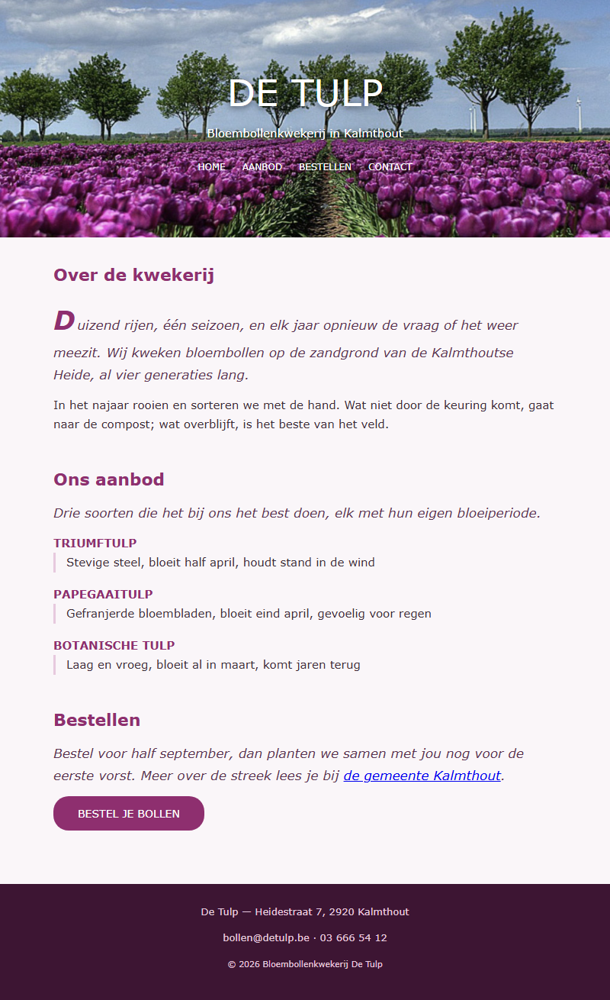

## Doel

Dit is een oefening op CSS design: kleuren, lettertypes, achtergronden, randen, effecten en het box model — zie [https://rogiervdl.github.io/CSS-course/02_design.html](https://rogiervdl.github.io/CSS-course/02_design.html) en [https://rogiervdl.github.io/CSS-course/03_boxmodel.html](https://rogiervdl.github.io/CSS-course/03_boxmodel.html).

## Opgave

De HTML van bloembollenkwekerij **De Tulp** is gegeven en pas je **niet** aan. Jij zorgt enkel voor de opmaak. In `styles.css` staan de TODO's op de juiste plaats — vul ze aan.

## Selectoren

In deze oefening gebruik je minstens deze soorten selectoren:

- een **id**-selector (bv voor de kop)
- **tag**-selectoren (bv voor de body, de titels en de paragrafen)
- **class**-selectoren (bv voor de knop)
- **combinaties** (bv voor de menulinks en voor de termen en omschrijvingen in de lijst)
- **`:hover`** (bv op de menulinks en op de knop)
- een **pseudo-element** (voor de beginletter) en een **contextuele selector** (voor de paragraaf na een titel)

## Taken

1. **body** — achtergrondkleur `#faf6f9`, tekstkleur `#3d2d38`, als lettertype `Verdana` met `Geneva` en `sans-serif` als reservewaarden, lettergrootte `15px` en regelhoogte `1.7`.
2. **Koppen en paragrafen** —
   - hoofdtitel in de kop: `48px`, niet vet, in hoofdletters
   - sectietitels: `22px`, kleur `#8e2f6f`, `12px` ruimte eronder
   - paragrafen: `12px` ruimte onder elke paragraaf
3. **kop** — de achtergrondafbeelding `img/tulpen.jpg`, die de volledige kop vult, gecentreerd staat en niet herhaalt. Zet ook `#3d1533` als achtergrondkleur voor het geval het beeld niet laadt. Witte tekst, gecentreerd, met `80px` ruimte boven en onder en `20px` links en rechts — de hoogte volgt dus uit de inhoud, geef de kop **geen** vaste hoogte. Geef de tekst een schaduw zodat ze leesbaar blijft: `0 2px 8px` in zwart met `60%` doorzichtigheid.
4. **Menulinks** — de regel die het menu naast elkaar zet is gegeven; jij doet de opmaak van de links zelf. Ze zijn wit, `12px`, in hoofdletters en zonder onderlijning. Bij hover worden ze `#f0b6dc`; laat die kleur vloeiend overgaan in `0.3s`.
5. **Beginletter en leadparagraaf** —
   - de **eerste letter** van de inleiding wordt `34px`, vetjes, kleur `#8e2f6f`, met `3px` ruimte rechts. Doe dat zonder de HTML aan te passen.
   - de paragraaf die **onmiddellijk op een sectietitel volgt** wordt `17px`, schuin en `#5c3552`. Ook dat selecteer je zonder extra class.
6. **Soorten** — in de soortenlijst worden de termen `#8e2f6f`, vetjes en in hoofdletters. De omschrijvingen krijgen een linkerrand van `3px` massief `#e7c9de`, `14px` ruimte links van de tekst en `16px` ruimte eronder.
7. **Knop** — dit is een echte `<button>`. Achtergrondkleur `#8e2f6f`, witte tekst, geen rand, afgeronde hoeken van `20px`, `14px` ruimte boven en onder en `32px` links en rechts, in hoofdletters en `14px`. Zorg dat de knop hetzelfde lettertype als de rest van de pagina gebruikt en dat de muisaanwijzer een handje wordt. Bij hover wordt de achtergrond `#5c1c47`, vloeiend in `0.3s`.
8. **footer** — achtergrondkleur `#3d1533`, tekstkleur `#e7c9de`, `13px`, `25px` ruimte boven en onder en `20px` links en rechts, gecentreerde tekst.

## Screenshot

