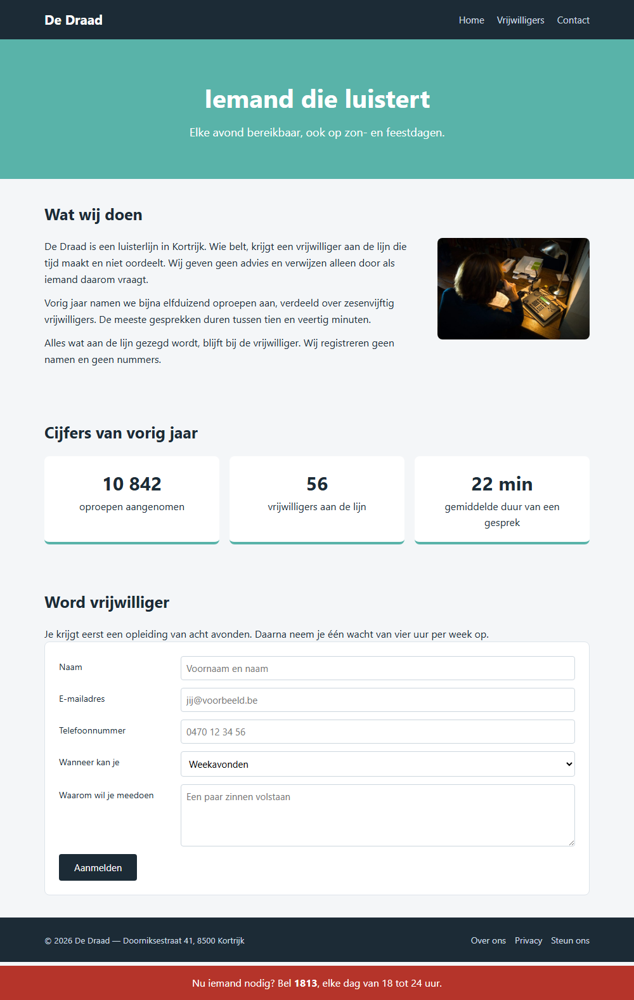

## Doel

Dit is een oefening op CSS layout: alignering, floating, flexbox, grid en positionering — zie [https://rogiervdl.github.io/CSS-course/04_layout.html](https://rogiervdl.github.io/CSS-course/04_layout.html).

## Opgave

De HTML en de opmaak van de site van luisterlijn **De Draad** zijn gegeven: kleuren, lettertypes en kaarten staan al goed. Alleen de **layout** ontbreekt — nu staat alles nog onder elkaar. Vul in `styles.css` de tien TODO's aan.

De HTML pas je **niet** aan. De nummers van de taken hieronder komen overeen met de nummers van de TODO's in de stylesheet.

## Technieken

In deze oefening gebruik je minstens:

- **flexbox** (bv voor het menu en de balken bovenaan en onderaan)
- **grid** (bv voor het aanmeldformulier)
- **floating** (bv voor de foto bij *Wat wij doen*)
- een **vastgezet element** (de rode balk onderaan)

Kies telkens de eenvoudigste techniek voor wat gevraagd wordt.

## Taken

1. **De pagina-inhoud** — is maximaal `900px` breed, staat horizontaal gecentreerd op de pagina, met `20px` ruimte links en rechts.
2. **De balk bovenaan** — het logo staat links, het menu rechts, en beide staan verticaal op dezelfde hoogte.
3. **Het hoofdmenu** — de menu-items staan naast elkaar met `20px` ertussen, zonder opsommingstekens.
4. **De foto bij *Wat wij doen*** — is `240px` breed en staat rechts, met `25px` ruimte ertussen; de tekst loopt er links van door.
5. **De cijfers** — de drie blokken staan naast elkaar met `16px` ertussen. Elk blok neemt een **even groot deel** van de beschikbare breedte in, ook al bevat het minder tekst dan zijn buur. Die tweede eis zet je op het blok zelf, niet op de container.
6. **Het aanmeldformulier** — twee kolommen naast elkaar: links een **vaste** kolom van `180px` met de bijschriften, rechts een kolom die de resterende ruimte opvult. `12px` tussenruimte, zowel tussen de kolommen als tussen de rijen.
7. **De knop** — is niet breder dan zijn eigen inhoud en staat links in zijn cel, niet uitgerekt over de volle breedte.
8. **De rode balk onderaan** — blijft onderaan het scherm staan over de volledige breedte, ook als je scrollt. Dat zie je niet op de screenshot.
9. **De paginavoet** — het copyright staat links, de links rechts, verticaal op dezelfde hoogte.
10. **De links in de voet** — staan naast elkaar met `14px` ertussen, zonder opsommingstekens.

## Screenshot

