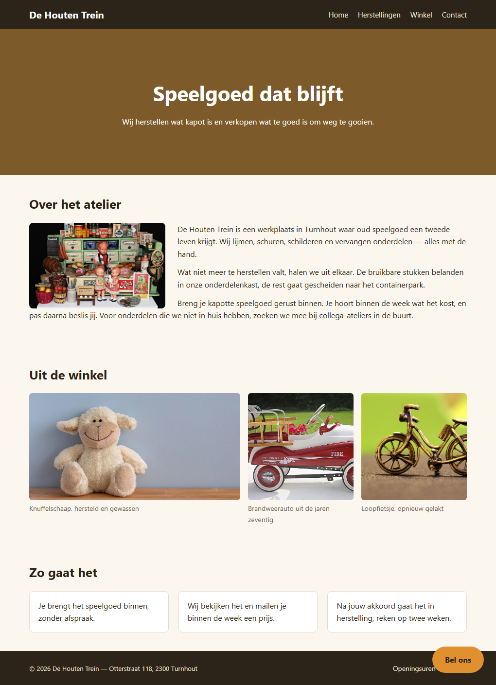

## Doel

Dit is een oefening op CSS layout: alignering, floating, flexbox, grid en positionering — zie [https://rogiervdl.github.io/CSS-course/04_layout.html](https://rogiervdl.github.io/CSS-course/04_layout.html).

## Opgave

De HTML en de opmaak van de site van speelgoedatelier **De Houten Trein** zijn gegeven: kleuren, lettertypes en kaarten staan al goed. Alleen de **layout** ontbreekt — nu staat alles nog onder elkaar. Vul in `styles.css` de tien TODO's aan.

De HTML pas je **niet** aan. De nummers van de taken hieronder komen overeen met de nummers van de TODO's in de stylesheet.

## Technieken

In deze oefening gebruik je minstens:

- **flexbox** (bv voor het menu, de hero en de balken bovenaan en onderaan)
- **grid** (bv voor de fotogalerij)
- **floating** (bv voor de foto bij *Over het atelier*)
- een **vastgezet element** (de oranje knop)

Kies telkens de eenvoudigste techniek voor wat gevraagd wordt.

## Taken

1. **De pagina-inhoud** — is maximaal `940px` breed, staat horizontaal gecentreerd op de pagina, met `20px` ruimte links en rechts.
2. **De balk bovenaan** — het logo staat links, het menu rechts, en beide staan verticaal op dezelfde hoogte.
3. **Het hoofdmenu** — de menu-items staan naast elkaar met `20px` ertussen, zonder opsommingstekens.
4. **De hero** — `300px` hoog. Titel en ondertitel staan onder elkaar met `12px` ertussen, en zijn zowel horizontaal als verticaal in het midden van de hero gecentreerd.
5. **De foto bij *Over het atelier*** — is `280px` breed en staat links, met `25px` ruimte ertussen; de tekst loopt er rechts van door.
6. **De fotogalerij** — drie kolommen naast elkaar met `16px` tussenruimte. De eerste kolom is **dubbel zo breed** als de twee andere, die even breed zijn.
7. **De stappen** — de drie stappen staan naast elkaar met `20px` ertussen, zonder nummers. Elke stap neemt een **even groot deel** van de beschikbare breedte in. Die laatste eis zet je op de stap zelf, niet op de container.
8. **De oranje knop** — blijft rechtsonder in beeld staan, ook als je scrollt, met `25px` van de onderrand en `25px` van de rechterrand.
9. **De paginavoet** — het copyright staat links, de links rechts, verticaal op dezelfde hoogte.
10. **De links in de voet** — staan naast elkaar met `14px` ertussen, zonder opsommingstekens.

## Screenshot

