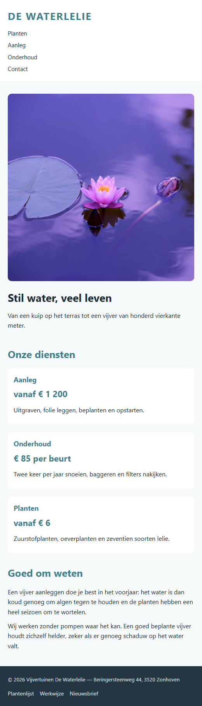
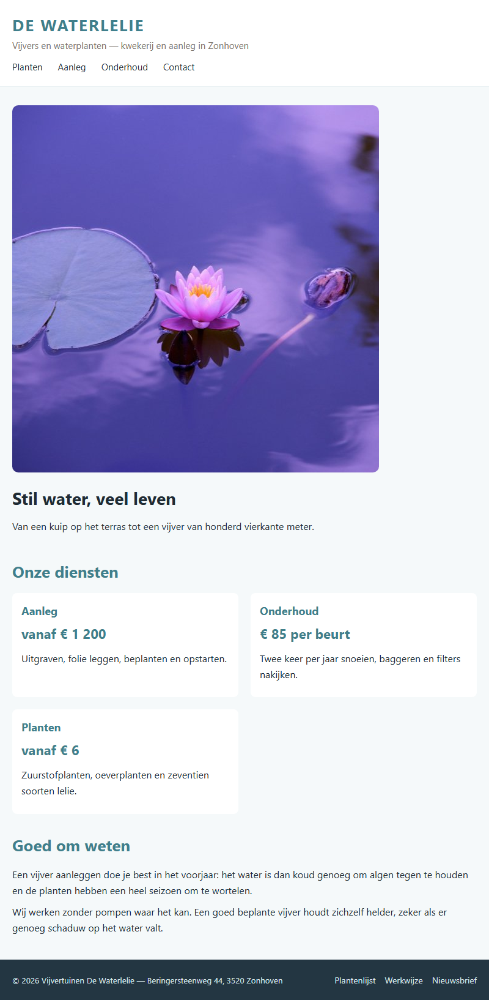
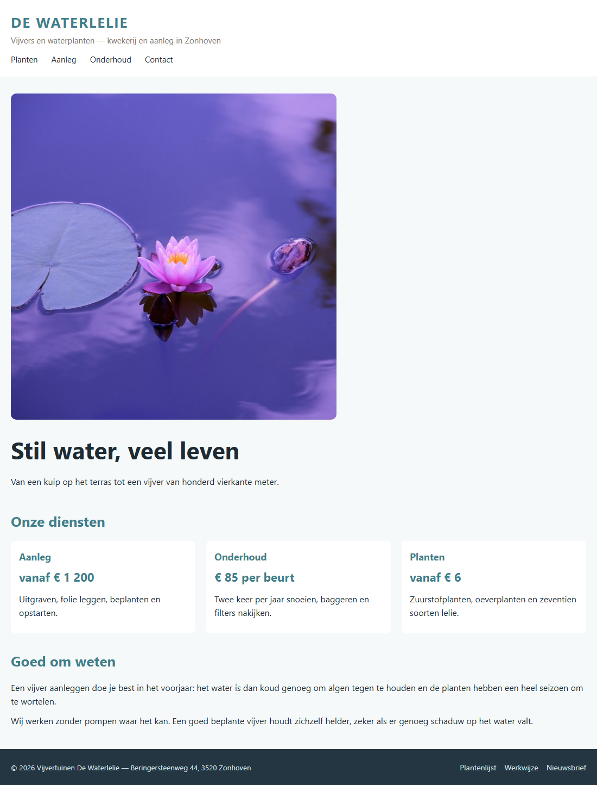

## Doel

Dit is een oefening op CSS responsive: viewport, flexibele layout, breakpoints en media queries — zie [https://rogiervdl.github.io/CSS-course/05_responsive.html](https://rogiervdl.github.io/CSS-course/05_responsive.html).

## Opgave

De site van **Vijvertuinen De Waterlelie** ziet er prima uit op een breed scherm, maar op een smartphone loopt alles mis: de pagina is breder dan het scherm en de tekst is onleesbaar. Maak de site responsive. Er zijn **twee** breakpoints nodig: `640px` en `960px`.

Hou je aan alle regels en best practices gezien in de cursus!

## Taken

1. **wrappers** — maak de breedte flexibel
2. **afbeeldingen** — maak ze flexibel
3. **hoofdtitel** — `28px` beneden `960px`, daarboven `44px`
4. **baseline** — standaard verborgen, toon ze vanaf `640px`
5. **menu-items** — staan standaard onder elkaar, met `5px` ertussen; vanaf `640px` staan ze naast elkaar, links uitgelijnd, met `25px` ertussen
6. **kaarten** — standaard één kolom, vanaf `640px` twee en vanaf `960px` drie kolommen

## Screenshots

Op een smal scherm (520px):

Vanaf 640px:

Vanaf 960px:

