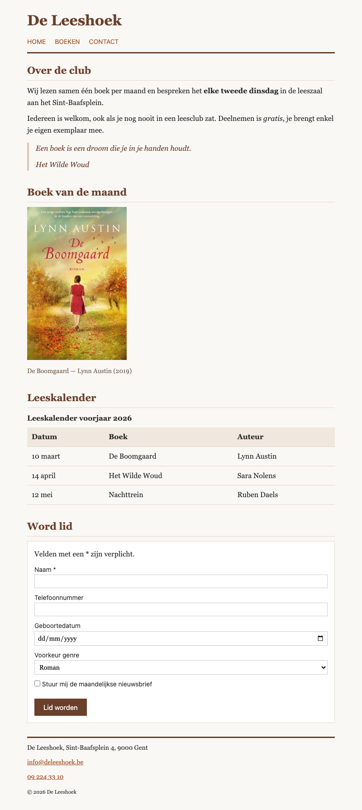

## Doel

Dit is een oefening op HTML: tekst, citaten, media, tabellen, formulieren en het structureren van een pagina — zie [https://rogiervdl.github.io/HTML-course/](https://rogiervdl.github.io/HTML-course/).

## Opgave

Bouw de pagina van boekenclub *De Leeshoek* volledig op in HTML op basis van de screenshot. Alle teksten krijg je hieronder kant en klaar: jij kiest voor elk stuk het **juiste element** en zet de pagina correct in elkaar. De opmaak staat in `styles.css` — dat bestand pas je **niet** aan. De afbeelding van het boek heet "boek.jpg" en staat in een submap "img".

## Screenshot

## Inhoud

Alle teksten van de pagina staan hieronder, zonder opmaak, zodat je ze kan kopiëren.

De Leeshoek

Home

Boeken

Contact

Over de club

Wij lezen samen één boek per maand en bespreken het elke tweede dinsdag in de leeszaal aan het Sint-Baafsplein.

Iedereen is welkom, ook als je nog nooit in een leesclub zat. Deelnemen is gratis, je brengt enkel je eigen exemplaar mee.

Een boek is een droom die je in je handen houdt.

Het Wilde Woud

Boek van de maand

De Boomgaard — Lynn Austin (2019)

Leeskalender

Leeskalender voorjaar 2026

Datum   Boek   Auteur

10 maart   De Boomgaard   Lynn Austin

14 april   Het Wilde Woud   Sara Nolens

12 mei   Nachttrein   Ruben Daels

Word lid

Velden met een * zijn verplicht.

Naam *

Telefoonnummer

Geboortedatum

Voorkeur genre

Roman

Thriller

Non-fictie

Stuur mij de maandelijkse nieuwsbrief

Lid worden

De Leeshoek, Sint-Baafsplein 4, 9000 Gent

info@deleeshoek.be

09 224 33 10

© 2026 De Leeshoek
