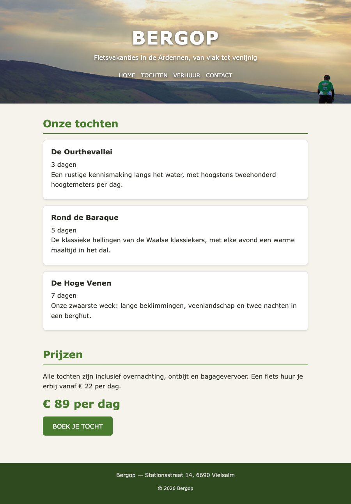

## Doel

Dit is een oefening op CSS design: kleuren, lettertypes, achtergronden, randen, effecten en het box model — zie [https://rogiervdl.github.io/CSS-course/02_design.html](https://rogiervdl.github.io/CSS-course/02_design.html) en [https://rogiervdl.github.io/CSS-course/03_boxmodel.html](https://rogiervdl.github.io/CSS-course/03_boxmodel.html).

## Opgave

De HTML van de fietsvakantiesite **Bergop** is gegeven en pas je **niet** aan. Jij zorgt enkel voor de opmaak. In `styles.css` staan de TODO's op de juiste plaats — vul ze aan.

## Taken

1. **body** — achtergrondkleur `#f5f3ec`, tekstkleur `#2a2a24`, als lettertype `Roboto` met `Verdana` en `sans-serif` als reservewaarden, lettergrootte `16px` en regelhoogte `1.6`.
2. **Koppen en paragrafen** —
   - hoofdtitel in de header: `46px`, in hoofdletters, met `2px` letterafstand
   - groene titels: `26px`, kleur `#4a7c2f`, met een onderrand van `2px` in diezelfde kleur en `5px` ruimte tussen tekst en rand; `15px` ruimte onder de kop
   - zwarte titels: `18px`, `5px` ruimte eronder
   - paragrafen: `10px` ruimte onder elke paragraaf
3. **.hero** — de achtergrondafbeelding `img/fietser.jpg`, die de volledige kop vult, gecentreerd staat en niet herhaalt. Zet ook `#2f4a1e` als achtergrondkleur voor het geval het beeld niet laadt. Witte tekst, gecentreerd, met `60px` ruimte boven en onder en `20px` links en rechts — de hoogte van de kop volgt dus uit de inhoud, geef ze **geen** vaste hoogte. Geef de tekst een schaduw zodat ze leesbaar blijft: `0 2px 6px` in zwart met `60%` doorzichtigheid.
4. **Menulinks** — de `.menu`-regel is gegeven; jij doet de opmaak van de links zelf. Ze zijn wit, `14px`, in hoofdletters en zonder onderlijning. Bij hover worden ze `#b8dd8f`; laat die kleur vloeiend overgaan in `0.3s`.
5. **.tocht** — witte achtergrond, rand van `1px` massief `#ddd`, afgeronde hoeken van `8px`, `15px` ruimte boven en onder en `20px` links en rechts, `15px` ruimte onder elke kaart, en een lichte schaduw `0 2px 5px` in zwart met `8%` doorzichtigheid.
6. **.prijs** — kleur `#4a7c2f`, `28px` en vetjes.
7. **.button** — achtergrondkleur `#4a7c2f`, witte tekst, geen onderlijning, in hoofdletters, afgeronde hoeken van `6px` en `12px` ruimte boven en onder, `25px` links en rechts. Zorg dat die ruimte ook echt zichtbaar is (denk aan het verschil tussen inline en block). Bij hover wordt de achtergrond `#2f4a1e`, vloeiend in `0.3s`.
8. **footer** — achtergrondkleur `#2f4a1e`, tekstkleur `#ddd`, `14px`, `20px` ruimte rondom en gecentreerde tekst.

## Screenshot

