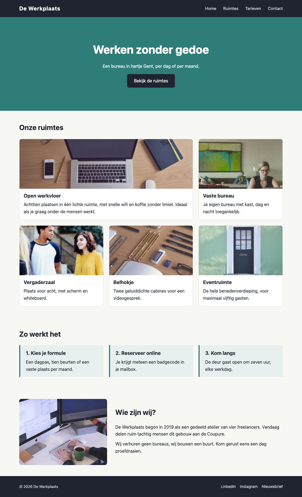

## Doel

Dit is een oefening op CSS layout: alignering, flexbox en grid — zie [https://rogiervdl.github.io/CSS-course/04_layout.html](https://rogiervdl.github.io/CSS-course/04_layout.html).

## Opgave

De HTML en de opmaak van de coworkingsite **De Werkplaats** zijn gegeven: kleuren, lettertypes en kaarten staan al goed. Alleen de **layout** ontbreekt — nu staat alles nog onder elkaar. Vul in `styles.css` de tien TODO's aan met flexbox en grid.

De HTML pas je **niet** aan. De nummers van de taken hieronder komen overeen met de nummers van de TODO's in de stylesheet.

## Taken

1. **De pagina-inhoud** — is maximaal `1000px` breed, staat horizontaal gecentreerd op de pagina, met `20px` ruimte links en rechts.
2. **De topbar** — het logo staat links, het menu rechts, en beide staan verticaal op dezelfde hoogte.
3. **Het hoofdmenu** — de menu-items staan naast elkaar met `25px` ertussen, zonder opsommingstekens.
4. **De hero** — `340px` hoog. Titel, ondertitel en knop staan onder elkaar, met `15px` ertussen, en zijn zowel horizontaal als verticaal in het midden van de hero gecentreerd.
5. **Het overzicht van de ruimtes** — een raster van **drie even brede kolommen** met `20px` tussenruimte.
6. **De uitgelichte ruimte** — de eerste kaart is **twee kolommen breed**.
7. **.stappen en .stap** — de drie stappen staan naast elkaar met `20px` ertussen. Elke stap neemt een **even groot deel** van de beschikbare breedte in, ook al bevat ze minder tekst dan haar buur. Die tweede eis zet je op de stap zelf, niet op de container.
8. **Het infoblok onderaan** — twee kolommen naast elkaar: links een **vaste** kolom van `320px` met de afbeelding, rechts een kolom die de resterende ruimte opvult. `30px` ertussen, verticaal gecentreerd.
9. **De paginavoet** — het copyright staat links, de sociale links rechts, verticaal op dezelfde hoogte.
10. **De sociale links** — staan naast elkaar met `15px` ertussen, zonder opsommingstekens.

## Screenshot

