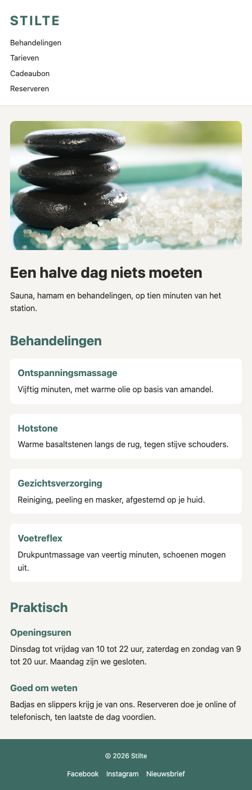
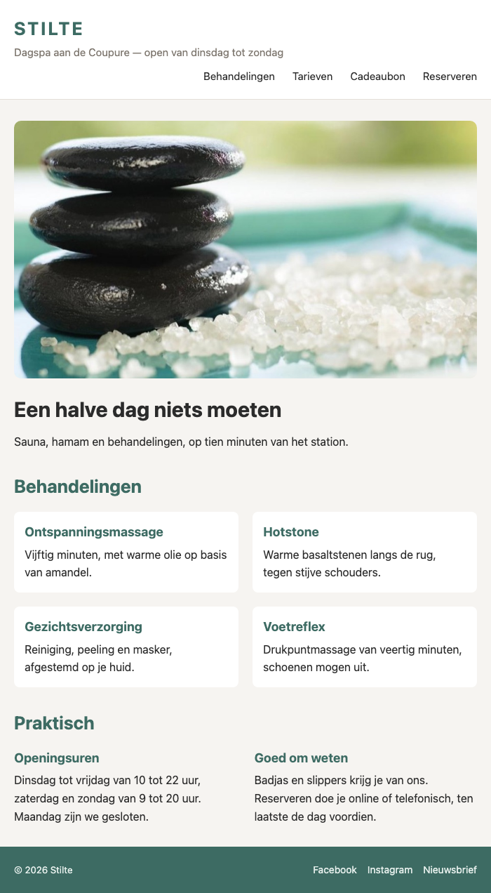
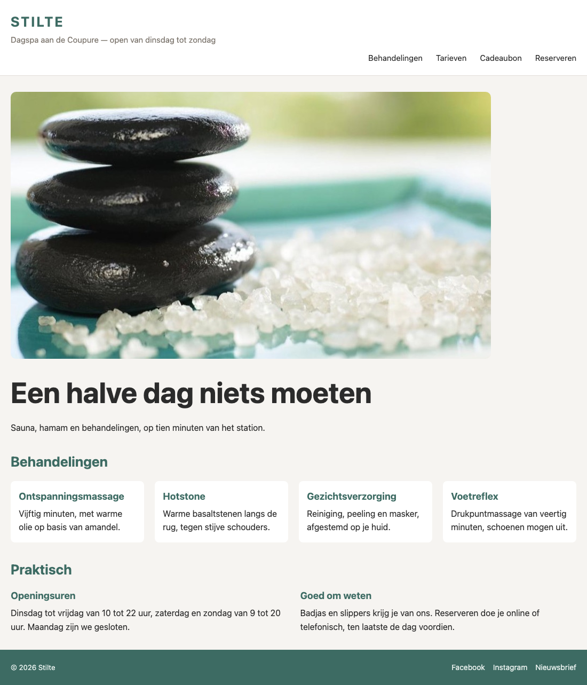

## Doel

Dit is een oefening op CSS responsive: viewport, flexibele layout, breakpoints en media queries — zie [https://rogiervdl.github.io/CSS-course/05_responsive.html](https://rogiervdl.github.io/CSS-course/05_responsive.html).

## Opgave

De site van dagspa **Stilte** ziet er prima uit op een breed scherm, maar op een smartphone loopt alles mis: de pagina is breder dan het scherm en de tekst is onleesbaar. Maak de site responsive. Er zijn **twee** breakpoints nodig: `600px` en `900px`.

Hou je aan alle regels en best practices gezien in de cursus!

## Taken

1. **wrappers en afbeeldingen** — maak ze flexibel
3. **menu-items** —  staan standaard onder elkaar, met `5px` ertussen; boven `600px` staan ze naast elkaar, rechts uitgelijnd, met `25px` ertussen
4. **hoofdtitel** — `30px` beneden `900px`, daarboven `54px`.
5. **tagline** — standaard verborgen, toon het vanaf `600px`.
6. **behandelingen** — standaard één kolom, vanaf `600px` twee en vanaf `900px` vier kolommen.
7. **info** — beneden `600px` één kolom, daarboven twee
8. **copyright en sociale links** — staan standaard onder elkaar, gecentreerd, met `10px` ertussen; vanaf `600px` naast elkaar, met de vrije ruimte ertussen

## Screenshots

Op een smal scherm (500px):

Vanaf 600px:

Vanaf 900px:

