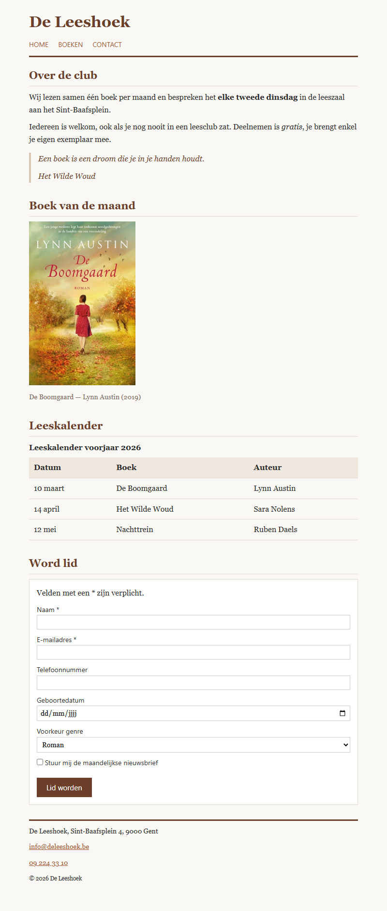

## Herhaling 1 — HTML

**Richttijd: 25 minuten.**

Bouw de pagina van boekenclub *De Leeshoek* volledig op in HTML. Alle teksten krijg je hieronder kant en klaar: jij kiest voor elk stuk het **juiste element** en zet de pagina correct in elkaar. De opmaak staat al in `styles.css` — dat bestand pas je **niet** aan.

Klopt je structuur, dan ziet je pagina er ongeveer uit zoals de screenshot onderaan.

## Opdracht

1. **Paginakop** — zet de clubnaam *De Leeshoek* als paginatitel bovenaan, samen met het hoofdmenu. Het menu bevat de links *Home*, *Boeken* en *Contact*; gebruik `#` als bestemming.
2. **Pagina-inhoud** — alles tussen kop en voet hoort in de eigenlijke pagina-inhoud, verdeeld in **vier** logische delen met elk een eigen titel: *Over de club*, *Boek van de maand*, *Leeskalender* en *Word lid*.
3. **Over de club** — de twee paragrafen hieronder. Markeer in de eerste paragraaf `elke tweede dinsdag` als belangrijke informatie, en in de tweede paragraaf het woord `gratis` met nadruk.
4. Sluit dat deel af met het citaat hieronder, met daarbij de titel van het werk waaruit het komt.
5. **Boek van de maand** — toon de afbeelding `img/boek.png` met een zinvolle alternatieve tekst, en zet er het onderschrift `De Boomgaard — Lynn Austin (2019)` bij. Beeld en onderschrift horen bij elkaar.
6. **Leeskalender** — maak een tabel met de gegevens hieronder. De tabel krijgt een titel via HTML (geen heading), de kolomtitels zijn kopcellen met de juiste reikwijdte, en kop- en gegevensrijen staan in aparte tabeldelen.
7. **Word lid** — maak het formulier met de velden hieronder. Elk veld heeft een label, elk veld krijgt het meest specifieke type, en het formulier heeft een verzendknop met opschrift `Lid worden`. De mededeling `Velden met een * zijn verplicht.` staat bovenaan **binnen** het formulier.
8. **Paginavoet** — zet de contactgegevens in het element dat daarvoor bedoeld is, met een werkende e-mail- en telefoonlink. Daaronder komen de kleine lettertjes.
9. Gebruik nergens `<article>`, `<b>`, `<i>`, `<u>`, inline styles of een ` ` om ruimte te maken.

## Inhoud

**Over de club**

> Wij lezen samen één boek per maand en bespreken het elke tweede dinsdag in de leeszaal aan het Sint-Baafsplein.
>
> Iedereen is welkom, ook als je nog nooit in een leesclub zat. Deelnemen is gratis, je brengt enkel je eigen exemplaar mee.

**Citaat**

> Een boek is een droom die je in je handen houdt.

Uit: *Het Wilde Woud*

**Leeskalender**

| Datum    | Boek           | Auteur      |
|----------|----------------|-------------|
| 10 maart | De Boomgaard   | Lynn Austin |
| 14 april | Het Wilde Woud | Sara Nolens |
| 12 mei   | Nachttrein     | Ruben Daels |

Titel van de tabel: `Leeskalender voorjaar 2026`

**Formulier**

| Label              | Bijzonderheden                                |
|--------------------|-----------------------------------------------|
| Naam *             | verplicht                                      |
| E-mailadres *      | verplicht                                      |
| Telefoonnummer     |                                                |
| Geboortedatum      |                                                |
| Voorkeur genre     | keuzelijst met *Roman*, *Thriller*, *Non-fictie* |
| Nieuwsbrief        | aankruisvakje, tekst `Stuur mij de maandelijkse nieuwsbrief` |

**Contactgegevens**

> De Leeshoek, Sint-Baafsplein 4, 9000 Gent
> info@deleeshoek.be
> 09 224 33 10

**Kleine lettertjes**

> © 2026 De Leeshoek

## Screenshot

