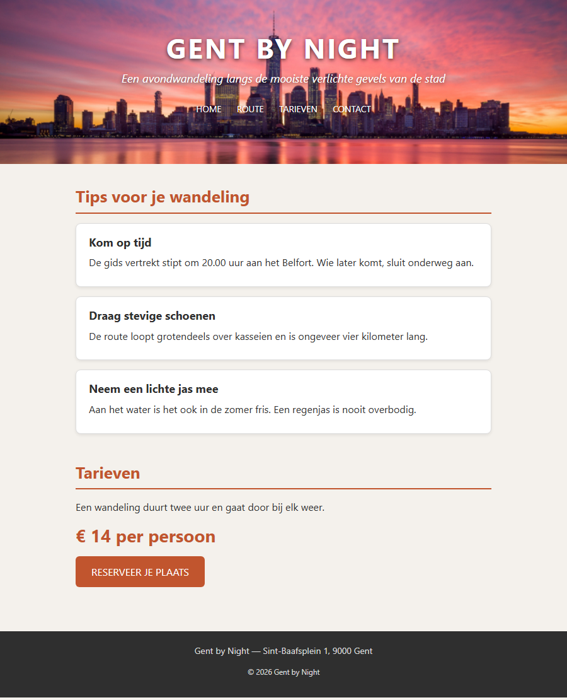

## Herhaling 2 — CSS design

**Richttijd: 20 minuten.**

De HTML van de wandelsite *Gent by Night* is klaar en pas je **niet** aan. Jij zorgt voor de opmaak: kleuren, lettertypes, achtergronden, randen en effecten. In `styles.css` staan de TODO's op de juiste plaats — vul ze aan.

Layout (flexbox en grid) komt hier **niet** aan bod: alles staat gewoon onder elkaar.

## Opdracht

1. **body** — achtergrondkleur `#f4f1ec`, tekstkleur `#2f2f2f`, een schreefloos lettertype (`system-ui` met een reservewaarde), lettergrootte `16px` en regelhoogte `1.6`.
2. **Koppen** —
   - `h1`: `44px`, in hoofdletters, met `3px` letterafstand
   - `h2`: `26px`, kleur `#c1552e`, met een onderrand van `2px` in diezelfde kleur en `5px` ruimte tussen tekst en rand; `15px` ruimte onder de kop
   - `h3`: `18px`, `5px` ruimte eronder
3. **Paragrafen** — `10px` ruimte onder elke paragraaf.
4. **.hero** — de achtergrondafbeelding `img/skyline.jpg`, die de volledige kop vult, gecentreerd staat en niet herhaalt. Zet ook `#2f2f2f` als achtergrondkleur voor het geval het beeld niet laadt. Hoogte `260px`, witte tekst, gecentreerd, `40px` ruimte boven en onder en `20px` links en rechts. Geef de tekst een schaduw zodat ze leesbaar blijft: `0 2px 6px` in zwart met `70%` doorzichtigheid.
5. **.tagline** — `18px` en cursief.
6. **Menu** — haal de opsommingstekens weg, zet `20px` ruimte boven het menu en plaats de items **naast elkaar** met `10px` ruimte ertussen. De links zijn wit, `14px`, in hoofdletters en zonder onderlijning. Bij hover worden ze `#f0a58a`; laat die kleur vloeiend overgaan in `0.3s`.
7. **main** — maximaal `700px` breed en horizontaal gecentreerd, met `30px` ruimte boven en onder en `20px` links en rechts. Elke `section` binnen `main` krijgt `40px` ruimte eronder.
8. **.tip** — witte achtergrond, rand van `1px` massief `#ddd`, afgeronde hoeken van `8px`, `15px` ruimte boven en onder en `20px` links en rechts, `15px` ruimte onder elke kaart, en een lichte schaduw `0 2px 5px` in zwart met `8%` doorzichtigheid.
9. **.prijs** — kleur `#c1552e`, `28px` en vetjes.
10. **.button** — achtergrondkleur `#c1552e`, witte tekst, geen onderlijning, in hoofdletters, afgeronde hoeken van `6px` en `12px` ruimte boven en onder, `25px` links en rechts. Zorg dat die ruimte ook echt zichtbaar is (denk aan het verschil tussen inline en block). Bij hover wordt de achtergrond `#8f3b1d`, vloeiend in `0.3s`.
11. **footer** — achtergrondkleur `#2f2f2f`, tekstkleur `#ddd`, `14px`, `20px` ruimte rondom en gecentreerde tekst.

## Aandachtspunten

- Gebruik `px` en `%` als eenheden, geen `em`.
- Sorteer je properties alfabetisch en gebruik de shorthand waar het kan.
- Schrijf kleuren hexadecimaal, behalve waar doorzichtigheid nodig is.

## Screenshot

