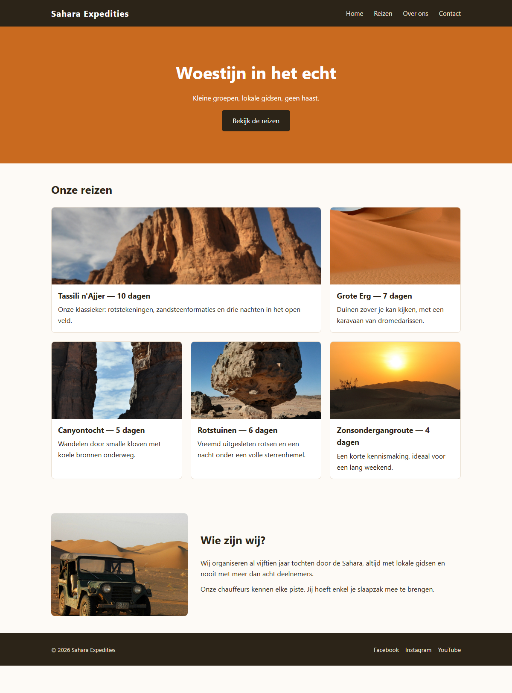

## Herhaling 3 — CSS layout

**Richttijd: 22 minuten.**

De HTML en de opmaak van de reissite *Sahara Expedities* zijn gegeven: kleuren, lettertypes en kaarten staan al goed. Alleen de **layout** ontbreekt — nu staat alles nog onder elkaar. Vul in `styles.css` de negen TODO's aan met flexbox en grid.

De HTML pas je **niet** aan.

## Opdracht

1. **.wrapper** — maximaal `1000px` breed, horizontaal gecentreerd op de pagina, met `20px` ruimte links en rechts.
2. **.topbar__inner** — het logo staat links, het menu rechts, en beide staan verticaal op dezelfde hoogte.
3. **.menu** — de menu-items staan naast elkaar met `25px` ertussen, zonder opsommingstekens.
4. **.hero** — `320px` hoog. Titel, ondertitel en knop staan onder elkaar, met `15px` ertussen, en zijn zowel horizontaal als verticaal in het midden van de hero gecentreerd.
5. **.reizen** — een raster van **drie even brede kolommen** met `20px` tussenruimte.
6. **.reis--uitgelicht** — deze eerste kaart is **twee kolommen breed**.
7. **.info** — twee kolommen naast elkaar: links een **vaste** kolom van `320px` met de afbeelding, rechts een kolom die de resterende ruimte opvult. `30px` ertussen, verticaal gecentreerd.
8. **.footer__inner** — het copyright staat links, de sociale links rechts, verticaal op dezelfde hoogte.
9. **.social** — de links staan naast elkaar met `15px` ertussen, zonder opsommingstekens.

## Aandachtspunten

- Kies per geval de eenvoudigste techniek: **flexbox** voor één richting, **grid** voor een raster of vaste kolommen.
- Gebruik `float` niet om layout te maken.
- Gebruik `fr`, `px` en `%` als eenheden, geen `em`.
- Zet nieuwe properties alfabetisch tussen de bestaande.

## Screenshot

